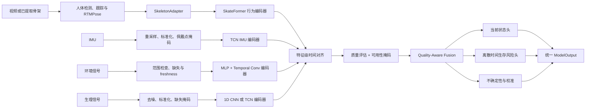

# QAF-SkateFormer 多模态跌倒风险预测算法方案

版本：v0.1 设计稿  
更新时间：2026-08-20  
当前状态：待 A0 输入输出协议实现与小样本验证

更新说明：SkateFormer 当前是稳定骨架基线，不再预设为不可替换的最终骨干。USDRL-DSTE、VideoMamba、V-JEPA 2.1 和 MOMENT 的候选依据与替换门禁见 [更先进的跌倒检测与风险预测 Baseline 调研](./advanced-fall-baseline-research.md)。QAF 融合和输出协议不依赖具体编码器。

## 1. 方案摘要

本项目拟训练一个独立于业务平台的多模态跌倒风险预测模型，算法工作名为：

```text
QAF-SkateFormer
Quality-Aware Fusion SkateFormer
```

它不是单纯的“倒地检测器”，而是一个同时完成以下任务的连续时序模型：

- 识别当前处于日常、失稳、正在跌倒、已经倒地或恢复状态；
- 仅根据当前及历史数据，预测未来 1 秒和 3 秒内的跌倒风险；
- 联合使用骨架行为、IMU、环境和生理时序信息；
- 在某些传感器缺失、延迟或质量下降时自动降低其融合权重；
- 输出经过校准的风险概率、不确定性和模态贡献，供后续平台实施分级干预。

第一版模型的主行为骨干采用 **SkateFormer（ECCV 2024）**，工程对照采用 **PoseC3D**，IMU 分支采用 **TCN**。本项目的核心改造是把通用骨架动作分类模型变成因果、多时间尺度、质量感知、可缺失模态运行的跌倒风险模型。

## 2. 任务定义与能力边界

### 2.1 第一版正式任务

第一版只研究两类有数据支撑的任务：

1. **当前状态识别**：判断锚点时刻的行为状态；
2. **短期前置预测**：预测未来 1 秒、3 秒内是否开始跌倒。

状态集合固定为：

```text
NORMAL      日常活动
UNSTABLE    失稳、近跌倒或跌倒前弱监督状态
FALLING     从跌倒动作开始到身体冲击或落地
FALLEN      落地后尚未恢复
RECOVERING  起身或恢复过程
```

预测时刻记为 `t`，下一次跌倒开始时刻记为 `τ`。模型只能使用 `t` 及之前的数据：

```text
P(state_t | observations_<=t)
P(τ <= t + 1s | observations_<=t)
P(τ <= t + 3s | observations_<=t)
```

任何包含 `t` 之后视频帧或传感器读数的样本，都不能计入“前置预测”实验。

### 2.2 第一版不声称解决的任务

当前公开数据以志愿者模拟跌倒为主，不足以支持“未来几天、几周或几个月是否会跌倒”的临床结论。因此第一版不声称：

- 已完成长期临床跌倒风险评估；
- 已在真实老年人群中证明医疗效果；
- 模态权重等同于医学因果解释；
- 模拟数据上的高准确率可直接代表真实养老院或家庭表现。

长期风险需要真实老年人纵向随访、疾病和用药史、步态量表、既往跌倒史等数据，后续应作为独立研究任务开展。

## 3. Baseline 与创新演进

本方案保留三层基线，确保每一步提升都能被科学归因。

### 3.1 工程基线：RTMPose + PoseC3D

流程为：

```text
视频 → 人体检测/跟踪 → RTMPose → 2D 姿态热图 → PoseC3D → 状态/风险输出
```

它的作用是先验证视频解码、姿态、标签、滑窗、评测和模型导出是否正确。PoseC3D 不是最终创新模型，但其工具链成熟，适合作为最低可复现基线。

### 3.2 主研究基线：RTMPose + SkateFormer

流程为：

```text
视频 → 人体检测/跟踪 → RTMPose → 2D 骨架序列 → SkateFormer → 状态/风险输出
```

SkateFormer 原本用于完整动作片段分类。它能够联合建模局部/全局关节关系和短/长时序关系，适合表示失衡、躯干倾斜、支撑关系变化以及快速下落等跌倒相关运动。

迁移时只复用语义和形状兼容的预训练层，重新适配关键点布局、位置编码和任务头。官方预训练精度不能当成本项目跌倒性能。

### 3.3 多模态基线：SkateFormer + TCN + 简单后融合

在真正同步的 UP-Fall 样本上，首先使用简单特征拼接或固定权重后融合：

```text
Skeleton feature ┐
                 ├→ Concatenate/MLP → state head + risk head
IMU feature      ┘
```

只有当这个基线成立后，才加入质量感知门控。这样可以区分性能提升究竟来自“增加了 IMU”，还是来自新的融合结构。

### 3.4 最终算法：QAF-SkateFormer

最终模型在 SkateFormer 行为编码器之外增加：

- IMU、环境、生理数据的独立编码器；
- 基于时间戳的特征级对齐；
- 可用性掩码和输入质量估计；
- 质量感知门控融合；
- 因果状态头和离散时间生存风险头；
- 模态缺失训练和概率校准。

完整演进顺序为：

```text
PoseC3D
  → SkateFormer
  → SkateFormer + causal state/risk heads
  → SkateFormer + TCN simple fusion
  → QAF fusion
  → QAF + modality dropout + calibration
```

## 4. 总体架构



所有模态先独立编码，再在共同特征空间进行对齐和融合。模型不会把不同采样率的原始信号直接粗暴拼接，也不会为缺失模态伪造观测值。

## 5. 输入协议

### 5.1 统一输入

训练和推理使用同一个逻辑协议：

```python
ModelInput = {
    "skeleton": FloatTensor[B, Tv, V, 3],
    # x、y、confidence；坐标已归一化

    "imu": FloatTensor[B, Ti, Ci],
    # 加速度、角速度及可选派生量

    "environment": FloatTensor[B, Te, Ce],
    # 红外、光照、温湿度等；未接入通道由 mask 标识

    "physiology": FloatTensor[B, Tp, Cp],
    # EEG、心率、血氧等；未接入通道由 mask 标识

    "timestamps": {
        "skeleton": FloatTensor[B, Tv],
        "imu": FloatTensor[B, Ti],
        "environment": FloatTensor[B, Te],
        "physiology": FloatTensor[B, Tp]
    },

    "modality_mask": BoolTensor[B, 4],
    # 顺序固定为 skeleton / imu / environment / physiology

    "quality": FloatTensor[B, 4]
    # 每个模态的外部质量先验，范围 [0, 1]
}
```

### 5.2 输入约束

- 所有时间戳统一为相对窗口起点的秒数，并保存原始绝对时间用于审计；
- 骨架默认使用 `64` 帧、`10 FPS`，即约 `6.4` 秒历史窗口；
- IMU 保留较高采样率，由 IMU 编码器内部降采样；
- 环境低频信号除数值外还必须携带“距最后一次有效采样的时间”；
- 缺失模态采用零张量加 `modality_mask=False`，零值本身不代表缺失；
- 批内至少存在一个有效模态；全部模态缺失时必须拒绝推理；
- 关键点布局、通道顺序、单位、采样率和归一化参数必须写入模型包。

### 5.3 骨架布局适配

SAFER、UP-Fall、RTMPose 与 SkateFormer 官方预训练数据可能使用不同关键点布局，因此设置显式 `SkeletonAdapter`：

1. 将数据集关键点映射到项目统一布局；
2. 进行人体中心化和尺度归一化；
3. 保留每个关键点置信度；
4. 对无法可靠映射的关节使用掩码，不凭经验补造坐标；
5. 记录多人场景的 track id，防止跨人拼接序列；
6. 对插值帧保留插值标识，供质量模块降低权重。

项目统一布局在 A0 阶段冻结，冻结后修改布局必须提升输入协议版本。

## 6. 单模态编码器

### 6.1 骨架行为编码器

主编码器为 SkateFormer。输入为归一化骨架序列：

```text
X_s ∈ R^(B × Tv × V × 3)
```

主要改造包括：

- 替换原始通用动作分类头；
- 增加因果时间掩码，保证输出不依赖未来帧；
- 输出窗口级行为表示 `z_s` 和可选的时间 token；
- 将关键点置信度和有效关节掩码纳入输入；
- 加入骨架遮挡、关键点抖动、帧丢失和速度扰动增强。

行为编码器通过统一接口实现。USDRL-DSTE 用于检验密集因果表征能否改善前置预测；若 SkateFormer 或 USDRL 在目标推理设备上不满足延迟要求，可以切换为 BlockGCN；RGB 上界可以使用 VideoMamba 或冻结的 V-JEPA 2.1。无论选择哪种编码器，融合层和输出协议保持不变。

### 6.2 IMU 编码器

第一版使用残差 TCN：

```text
IMU → channel normalization → temporal convolution blocks
    → masked temporal pooling → z_i
```

选择 TCN 的原因是结构简单、训练稳定、易于因果化和导出。通道包含不同佩戴点的三轴加速度、三轴角速度以及可选模长；佩戴点缺失必须使用通道掩码。

需要验证的 IMU 增强包括：

- 轴向小角度旋转；
- 高斯噪声和零偏漂移；
- 短时通道丢失；
- 采样抖动；
- 传感器饱和或平线故障。

### 6.3 环境编码器

环境信号可能包含红外、光照、温湿度和房间状态。其采样率通常低于视频和 IMU，第一版采用：

```text
[value, missing mask, age/freshness] → MLP → Temporal Conv → z_e
```

环境信号主要用于提供场景上下文和传感器状态，不应在缺乏证据时被解释为直接导致跌倒。

### 6.4 生理编码器

生理分支预留 EEG、心率和血氧等输入，采用 1D CNN 或 TCN。第一轮只有在数据集提供同步、许可清楚且质量可控的信号时才训练该分支；否则保留接口并在模型包中标记为未训练，不能用随机数据声称多模态效果。

## 7. 时间对齐与质量建模

### 7.1 特征级时间对齐

各模态先在各自采样率下编码，再依据时间戳对齐到公共锚点，避免把 10 FPS 骨架、几十或上百 Hz IMU 和低频环境数据直接重采样到同一原始频率。

对每个模态 `m`：

```text
z_m = E_m(x_m, timestamps_m, masks_m)
```

编码器输出经过线性投影进入共同维度 `D`：

```text
u_m = P_m(z_m),  u_m ∈ R^D
```

对齐模块同时输出时间同步误差 `Δt_m`。低频传感器保留 freshness，而不是将旧值无限向前填充并视作新观测。

### 7.2 模态质量分数

每个模态的质量分数由可解释的输入统计量和可学习模块共同确定。

骨架质量参考：

- 有效关键点比例和平均置信度；
- 躯干、髋和腿部关键点是否可见；
- track 是否连续、是否发生身份切换；
- 插值帧比例和坐标跳变；
- 人体是否过小、出画或严重遮挡。

IMU 质量参考：

- 丢包率、采样间隔抖动；
- 饱和、平线、异常尖峰；
- 通道和佩戴点可用率；
- 与公共锚点的同步误差。

环境和生理质量参考：

- 缺失率、范围有效性；
- 距最近有效值的时间；
- 信号噪声和设备状态；
- 与其他模态的同步误差。

所有外部质量规则必须可测试、可审计；可学习质量头不能替代基本的数据有效性检查。

## 8. QAF 质量感知融合

### 8.1 融合公式

设模态集合为 `M={skeleton, imu, environment, physiology}`。对模态 `m`：

- `u_m` 为共同空间中的特征；
- `q_m∈[0,1]` 为质量分数；
- `a_m∈{0,1}` 为可用性；
- `Δt_m` 为与预测锚点的时间误差或数据年龄。

首先计算门控分数：

```text
g_m = w_g^T tanh(W_u u_m + W_q φ(q_m, Δt_m))
```

随后执行带可用性掩码的 softmax：

```text
α_m = MaskedSoftmax(g_m, a_m)
```

融合表示为：

```text
z_fused = LayerNorm(Σ_m α_m · u_m + u_context)
```

其中 `u_context` 可由公共时间编码和可用模态模式生成。不可用模态的 `α_m` 必须严格为零，有效模态权重之和为一。

### 8.2 设计约束

- 质量差不等于信息一定无用，质量只作为门控证据之一；
- 模态权重用于描述当前模型的融合贡献，不能当作医学因果解释；
- 当只有一个模态可用时，其权重为一，模型仍输出同一结构；
- 当高质量模态被遮挡或断连时，模型不应因零填充产生虚假高置信度；
- 质量门控是否有效必须通过“人为降低某模态质量后权重和性能如何变化”验证。

### 8.3 Modality Dropout

训练期间随机屏蔽整个模态或部分通道：

```text
video only
IMU only
video + IMU
video + environment
all available modalities
```

屏蔽模式需要接近未来真实部署的设备组合，不能只使用均匀随机概率。模型必须在每种允许的模态组合下保持数值稳定；性能下降应随信息减少而平滑变化，而不是直接崩溃。

## 9. 多任务输出头

### 9.1 当前状态头

```text
p_state = Softmax(MLP_state(z_fused))
```

输出顺序固定为：

```text
[NORMAL, UNSTABLE, FALLING, FALLEN, RECOVERING]
```

状态头负责处理已经开始的跌倒和跌倒后状态。短期风险头只用于尚未进入跌倒事件的时刻，不能用“已经 FALLING”产生的高分冒充提前预警。

### 9.2 离散时间生存风险头

直接训练互相独立的 1 秒和 3 秒 sigmoid，可能出现“3 秒风险小于 1 秒风险”的逻辑错误。因此采用离散时间生存分析。

第一版风险区间为：

```text
I1 = (t, t+1s]
I2 = (t+1s, t+3s]
```

模型输出每个区间的条件风险：

```text
h_k = sigmoid(r_k)
```

累计风险为：

```text
R_k = 1 - Π_(j=1..k)(1 - h_j)
```

因此天然满足：

```text
0 ≤ R_1s ≤ R_3s ≤ 1
```

训练时：

- 跌倒在某区间开始时，将该区间作为事件区间；
- 观察结束前没有跌倒的样本按右删失处理；
- 锚点已经处于 `FALLING/FALLEN` 时，不参与短期风险损失；
- 推理阶段若状态已为 `FALLING/FALLEN`，业务决策优先使用状态头，而不解释短期风险值。

### 9.3 不确定性与校准

第一版不把一个未经验证的神经网络标量直接称为可靠不确定性，而采用以下顺序：

1. 在验证集上进行 temperature scaling；
2. 报告 ECE 和 Brier Score；
3. 结合预测熵、输入质量和模态缺失情况形成 `uncertainty`；
4. 如单模型仍过度自信，再比较 MC Dropout 或小型深度集成。

校准参数只能由验证集确定，并与模型权重一起版本化。

### 9.4 统一输出

```python
ModelOutput = {
    "state_probabilities": FloatTensor[B, 5],
    "hazard_probabilities": FloatTensor[B, K],
    "cumulative_risk": FloatTensor[B, K],
    "uncertainty": FloatTensor[B, 1],
    "modality_weights": FloatTensor[B, 4],
    "embedding": FloatTensor[B, D]
}
```

其中第一版 `K=2`，分别对应 `(0,1]` 秒和 `(1,3]` 秒。`cumulative_risk[:,0]` 表示未来 1 秒风险，`cumulative_risk[:,1]` 表示未来 3 秒风险。

示例结果：

```json
{
  "state_probabilities": {
    "NORMAL": 0.16,
    "UNSTABLE": 0.61,
    "FALLING": 0.12,
    "FALLEN": 0.04,
    "RECOVERING": 0.07
  },
  "cumulative_risk": {
    "within_1s": 0.31,
    "within_3s": 0.58
  },
  "uncertainty": 0.18,
  "modality_weights": {
    "skeleton": 0.52,
    "imu": 0.35,
    "environment": 0.09,
    "physiology": 0.04
  }
}
```

该示例只说明协议，不代表已训练模型的真实预测。

## 10. 标签构造

### 10.1 当前状态标签

优先使用数据集的逐帧人工标注。不同数据集的原始标签通过 `LabelAdapter` 映射到统一状态，但必须遵循以下原则：

- 原数据只能区分 standing/falling/laying 时，不凭空生成可靠的 `UNSTABLE`；
- 某个状态不可从原标注确定时，对该状态损失使用 label mask；
- `UNSTABLE` 可先用跌倒前固定窗口生成弱标签，但要在报告中标注为 weak supervision；
- `RECOVERING` 只有在起身过程可由标注或清晰规则识别时才参与监督；
- 普通躺卧不能映射为 `FALLEN`，必须结合跌倒事件历史。

### 10.2 风险标签

对每个锚点 `t` 查找同一受试者同一连续记录中的下一次跌倒开始时刻 `τ`：

- `0 < τ-t ≤ 1s`：事件位于第一个风险区间；
- `1s < τ-t ≤ 3s`：事件位于第二个风险区间；
- 未来 3 秒可完整观察且无跌倒：完整负样本；
- 记录在 3 秒内结束且未观察到跌倒：右删失样本；
- `t ≥ τ`：不参与前置风险损失。

负样本应覆盖行走、坐下、躺下、弯腰、快速转身和被遮挡等困难场景，不能只从静止站立中采样。

### 10.3 防止时间泄漏

- 姿态平滑只能使用因果滤波；
- 窗口不得越过预测锚点读取未来帧；
- 归一化统计量只由训练集计算；
- 同一受试者、同一原视频或相邻片段不得跨集合；
- 阈值和 temperature 只能在验证集确定；
- 测试集只在模型、配置和阈值冻结后运行。

## 11. 损失函数

总损失定义为：

```text
L_total =
    λ_state       · L_state
  + λ_survival    · L_discrete_survival
  + λ_calibration · L_brier
  + λ_consistency · L_cross_modal_consistency
  + λ_robustness  · L_modality_robustness
```

### 11.1 状态损失

`L_state` 首选类别加权交叉熵。只有在类别不平衡导致困难样本长期被忽略时再对照 Focal Loss。权重只根据训练集统计，不能引用测试集分布。

### 11.2 离散生存损失

`L_discrete_survival` 对事件区间最大化其 hazard，并对事件发生前区间最大化生存概率；右删失样本只约束已观察区间。这样无需把被截断的样本错误标成完整负例。

### 11.3 校准损失

`L_brier` 用于约束概率与实际结局的一致性。它不能替代分类或生存损失，只作为风险概率质量的辅助约束。

### 11.4 跨模态一致性

`L_cross_modal_consistency` 只对同一时间、同一 trial 的同步模态施加表征或预测一致性约束。SAFER 视频和其他数据集的 IMU 不能随机配对计算该损失。

### 11.5 模态鲁棒性

`L_modality_robustness` 约束完整模态和随机缺失模态输入的输出不要发生不合理漂移。它不是要求两种输入完全相同；缺失关键信息时允许不确定性上升、风险概率变得更保守。

第一轮只启用：

```text
L_state + L_discrete_survival
```

其余损失逐项加入并进行消融，不能一次全部开启后只报告完整模型结果。

## 12. 数据集分工

### 12.1 SAFER-Activities

用于：

- PoseC3D 工程基线；
- SkateFormer 行为编码器训练和微调；
- 当前状态与短期风险任务；
- 跨受试者、跨视角和非实验室 OOD 测试；
- 普通躺卧与跌倒后状态的困难负样本构造。

SAFER 只提供视觉相关数据，不能单独证明视频与 IMU 的多模态融合有效。

### 12.2 UP-Fall

用于真正同步的多模态训练和验证：

- 视频/骨架与 IMU 时间对齐；
- 可穿戴传感器、环境红外/光照和 EEG 编码；
- 单模态、双模态和全部模态对照；
- 质量门控、模态缺失和时间错位实验。

UP-Fall 参与者规模较小且以健康年轻人模拟跌倒为主，因此用于证明融合机制和技术可行性，不单独代表真实养老场景效果。

### 12.3 OmniFall

用于视觉外部泛化：

- staged 数据到真实事故视频的域外测试；
- `FALLEN` 与普通躺卧的区分；
- 只有视频/骨架可用时的缺失模态路径。

### 12.4 多数据集训练规则

- 先在 SAFER 训练行为编码器，再在 UP-Fall 训练同步融合；
- 融合初期冻结大部分行为编码器，防止小数据集造成灾难性遗忘；
- 联合微调时使用 dataset-balanced sampler 和数据集专用输入适配器；
- 仅对数据集真实提供且可映射的标签计算损失；
- 绝不将不同数据集的不同受试者和不同事件随机拼成“同步多模态样本”。

## 13. 训练策略

### 13.1 阶段一：单模态预训练

1. 在 SAFER 上训练 PoseC3D，验证数据、标签和评测链路；
2. 载入 SkateFormer 官方预训练权重；
3. 适配关键点布局并重新初始化任务头；
4. 先冻结行为编码器，仅训练状态头和风险头；
5. 再逐步解冻后部模块，以较小学习率联合微调；
6. 在 UP-Fall 上独立训练 TCN IMU 基线。

### 13.2 阶段二：简单多模态融合

1. 使用同一 UP-Fall trial 的同步骨架和 IMU；
2. 冻结两个单模态编码器，训练简单 late fusion；
3. 与 skeleton-only、IMU-only 使用完全相同划分和评价脚本；
4. 简单融合稳定后逐步解冻编码器；
5. 再按数据可用性加入环境和生理分支。

### 13.3 阶段三：QAF 创新模块

按以下顺序逐项加入：

1. 模态可用性 mask；
2. 可解释的输入质量特征；
3. 可学习质量门控；
4. modality dropout；
5. 跨模态一致性损失；
6. temperature scaling 和不确定性输出。

每一步都保存独立配置、随机种子、权重和评测结果。

### 13.4 初始优化配置

第一轮建议：

- 优化器：AdamW；
- 学习率策略：warmup + cosine decay；
- 新任务头/融合层学习率：`1e-3` 起步；
- 预训练编码器学习率：`1e-4` 或 `1e-5`；
- 使用 gradient clipping；
- 早停主指标：验证集风险 AUPRC，并同时约束每小时误报；
- 至少运行 3 个固定随机种子，报告均值和标准差；
- 混合精度是否启用由 GPU 能力决定，不改变评价协议。

超参数是初始搜索范围，不是最终结论。最终值必须随 checkpoint 写入实验配置。

## 14. 实验矩阵与消融

必须至少完成以下实验：

```text
E0  PoseC3D skeleton only
E1  SkateFormer skeleton only
E2  TCN IMU only
E3  simple late fusion: skeleton + IMU
E4  E3 + available environment/physiology
E5  QAF with availability mask, without quality
E6  QAF + quality gate
E7  QAF + modality dropout
E8  full QAF-SkateFormer + calibration
```

除模型模块外，E0～E8 应尽可能保持相同的数据划分、标签映射、随机种子集合和评价脚本。

额外鲁棒性实验包括：

- 骨架遮挡比例逐级增加；
- 关键点噪声和 track 中断；
- IMU 单通道、单佩戴点或全部 IMU 缺失；
- 模态时间偏移 `±0.1s / ±0.5s / ±1s`；
- 环境或生理信号 freshness 增加；
- 只有 skeleton、只有 IMU 和全部模态三种部署模式；
- SAFER 跨视角、非实验室 OOD 和 OmniFall 外部测试。

## 15. 评价指标体系

### 15.1 当前状态识别

- 每类 Precision、Recall、F1；
- Macro-F1 和 Balanced Accuracy；
- `FALLING`、`FALLEN` 单独 F1；
- 混淆矩阵；
- 事件级灵敏度；
- 每小时误报数。

### 15.2 短期风险预测

- 未来 1 秒和 3 秒 AUPRC；
- time-dependent Brier Score；
- 离散生存负对数似然；
- 首次有效预警提前量；
- 预警覆盖率；
- ECE；
- 必要时报告 C-index，但不能只用 C-index。

预测发生在人工标注的跌倒开始之后，只能计入状态识别或事后响应，不能计入提前预警。

### 15.3 响应效率

- 单窗口推理 P50/P95 延迟；
- 实时因子和可持续 FPS；
- 从锚点到模型结果的算法延迟；
- 连续推理中的队列积压和丢窗率；
- 故障模态移除后的恢复时间。

服务器训练速度不等于未来平台推理速度。模型冻结后应在计划部署设备上单独测试延迟。

### 15.4 多模态有效性

- 融合模型相对最强单模态的指标增益；
- 每个模态的 leave-one-modality-out 消融；
- 不同模态缺失率下的性能曲线；
- 时间错位下的性能退化曲线；
- 质量门控前后的误报、AUPRC 和校准变化；
- 人为降低模态质量时，对应权重是否总体下降。

### 15.5 统计报告

- 至少 3 个随机种子，报告均值与标准差；
- 事件级指标按受试者 bootstrap 置信区间；
- 主要模型比较使用相同测试事件的配对分析；
- 同时报告成功指标和失败场景，不只选择最优一次运行。

## 16. 适老化分级干预接口

算法本身不发送通知，但输出必须支持清晰、低打扰、可升级的服务流程。建议后续平台使用以下决策顺序：

```text
状态已 FALLING/FALLEN
  → 立即进入高优先级事件确认

状态为 UNSTABLE 且 1s/3s 风险升高
  → 先执行低打扰语音/灯光提醒或看护端提示

风险连续升高、输入质量可靠、无人确认
  → 升级通知照护人员

输入质量差或不确定性高
  → 请求人工核验，不直接宣称老人已经跌倒
```

算法输出的是风险证据，不直接替代医疗判断。平台阈值需要根据不同场景的误报成本、照护资源和老年人交互能力，在验证集和试点中确定。

## 17. 推理与模型交付协议

训练完成后交付：

```text
qaf-skateformer-v0.1.0/
  model.onnx
  model-reference.pth
  manifest.yaml
  input-schema.json
  output-schema.json
  preprocess.yaml
  labels.json
  thresholds.yaml
  metrics.json
  model-card.md
  sha256sums.txt
```

统一推理入口：

```python
predictor = FallRiskPredictor.load("qaf-skateformer-v0.1.0")
result = predictor.predict(model_input)
```

模型包必须固化：

- 输入布局、单位、采样率和归一化参数；
- 支持的模态组合；
- 标签顺序和风险时间区间；
- 数据集版本、训练 split 和代码提交号；
- 预训练权重来源、许可证和 SHA-256；
- 校准参数与决策阈值；
- 已验证和未验证的使用场景；
- PyTorch 与 ONNX 输出一致性误差。

未来平台只需要完成原始数据到 `ModelInput` 的转换，并消费 `ModelOutput`；训练代码、优化器和数据集不进入平台运行环境。

## 18. 创新点表述

比赛材料可以将创新总结为四点，但必须以消融结果作为证据：

1. **从事后识别前移到因果短期预测**：通过仅使用历史数据的离散时间生存风险头预测未来 1 秒、3 秒跌倒风险；
2. **质量感知的多模态融合**：融合权重联合考虑内容、可用性、信号质量和时间同步误差；
3. **缺失模态安全退化**：通过 modality dropout 和统一 mask，使同一模型在传感器断连时继续工作并提高不确定性；
4. **面向养老场景的分级干预输出**：同时输出状态、风险、校准不确定性和模态贡献，为低打扰提醒、人工核验和升级告警提供依据。

如果某一模块没有在跨受试者或外部测试中带来稳定改善，就不应将其写成“有效创新”。

## 19. 主要风险与应对

### 19.1 模拟跌倒与真实老年跌倒存在域差异

应对：进行跨数据集测试、明确适用边界，并在后续真实养老场景试点中先做静默评测，不直接用于自动高风险决策。

### 19.2 多模态数据规模小

应对：先进行单模态预训练，融合阶段冻结大部分编码器；使用受试者独立划分、正则化和多随机种子，避免在 UP-Fall 上过拟合。

### 19.3 数据集标签不完全一致

应对：显式 `LabelAdapter`、label mask 和数据集级映射审计；无法确定的状态不生成伪精确标签。

### 19.4 预训练骨架布局不一致

应对：实现和测试 `SkeletonAdapter`；不兼容层重新初始化；用小样本门禁验证前向、反向和标签映射。

### 19.5 质量门控出现伪解释

应对：把模态权重表述为模型贡献而非因果解释；进行可控质量扰动、模态消融和失败案例审查。

### 19.6 数据和代码许可限制

应对：记录所有数据集、代码和权重的许可证、来源、提交号和校验值；研究比赛和商业产品分别审查，第三方大文件不直接提交 Git。

## 20. 实施阶段与验收门禁

### A0：协议与随机张量前向

- 冻结 `ModelInput`、`ModelOutput` 和统一骨架布局；
- 完成数据 manifest、subject split 和泄漏检查；
- 单模态、多模态和缺失模态均可前向；
- 验证 `R_3s ≥ R_1s`；
- 全部模态缺失时明确报错。

### A1：PoseC3D 工程基线

- 100～500 个窗口可完成过拟合测试；
- checkpoint 可保存、恢复并复现输出；
- 事件指标和前置指标脚本可运行。

### A2：SkateFormer 主基线

- 官方权重可加载并完成布局适配；
- 与 PoseC3D 使用相同 split、标签和评价；
- 无未来帧泄漏；
- 导出首个 skeleton-only 模型包。

### A3：TCN IMU 基线

- UP-Fall 按受试者划分；
- 单独 IMU 输出统一协议；
- 通道缺失和佩戴点缺失不会导致推理失败。

### A4：同步多模态基线

- 所有融合样本来自同一 trial 的同步数据；
- simple fusion 与最强单模态完成公平比较；
- 不存在受试者和相邻片段泄漏。

### A5：QAF 与消融

- availability、quality、dropout、calibration 逐项评测；
- 至少一项核心指标在多个随机种子下稳定改善；
- 输入质量降低时权重、不确定性和性能变化符合预期。

### A6：外部与故障鲁棒性

- 完成跨受试者、跨视角和 OOD；
- 完成 OmniFall 视觉外部测试；
- 完成遮挡、噪声、模态缺失和时间错位测试。

### A7：模型冻结与导出

- PyTorch 与 ONNX 输出通过数值一致性检查；
- 输入输出 Schema、阈值、指标和模型卡完整；
- 所有文件生成 SHA-256；
- 模型可在不安装训练代码的环境中加载和推理。

## 21. 方案完成标准

满足以下条件后，算法 v0.1 才可称为完成：

- 一个版本化 QAF-SkateFormer 模型包；
- skeleton-only、IMU-only、简单融合和完整模型的公平对照；
- 完整输入输出协议和独立推理入口；
- 状态识别、1 秒/3 秒风险、误报、提前量和校准指标；
- 受试者独立测试以及至少一项外部或 OOD 测试；
- 缺失模态、输入噪声和时间错位鲁棒性报告；
- 逐项消融能够说明每个创新模块是否有效；
- 模型卡明确数据局限、适用范围和失败案例；
- 训练服务器不需要部署平台，平台也不依赖训练环境。

## 22. 相关文档与官方资料

项目内文档：

- [主基线算法选型与创新路线](./baseline-algorithm-selection.md)
- [多模态算法训练执行方案](./ai-training-and-inference-execution-plan.md)
- [算法与模型调研](./algorithm-and-model-research.md)
- [分阶段开发与验收计划](./development-plan.md)

官方资料：

- SkateFormer：[论文](https://www.ecva.net/papers/eccv_2024/papers_ECCV/papers/05796.pdf) / [官方代码与权重](https://github.com/KAIST-VICLab/SkateFormer)
- PoseC3D：[MMAction2 官方配置与 checkpoint](https://github.com/open-mmlab/mmaction2/blob/main/configs/skeleton/posec3d/README.md)
- SAFER-Activities：[项目页](https://safer-activities.github.io/) / [数据卡](https://huggingface.co/datasets/SAFER-Activities/SAFER-Activities)
- UP-Fall：[数据集论文](https://pmc.ncbi.nlm.nih.gov/articles/PMC6539235/)
- OmniFall：[论文](https://arxiv.org/abs/2505.19889) / [实验代码](https://github.com/simplexsigil/omnifall-experiments)
- BlockGCN：[论文](https://openaccess.thecvf.com/content/CVPR2024/html/Zhou_BlockGCN_Redefine_Topology_Awareness_for_Skeleton-Based_Action_Recognition_CVPR_2024_paper.html) / [官方代码](https://github.com/ZhouYuxuanYX/BlockGCN)
