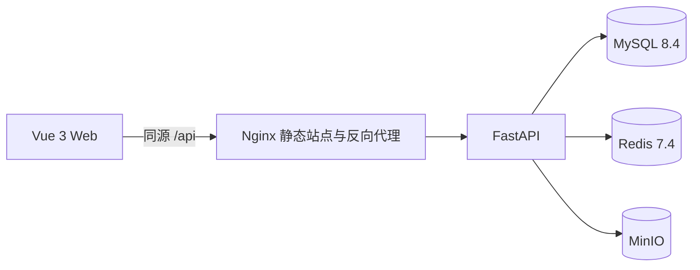
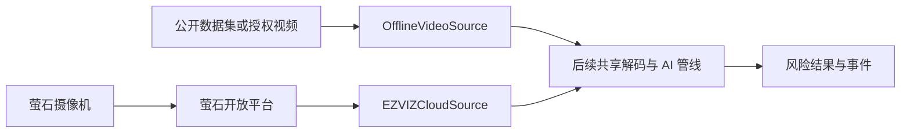

# 第一至三阶段及离线模拟架构与边界

## 当前可运行结构



第二阶段已新增服务端萤石网关、Token 管理和设备同步，但仍没有 AI、视频流或真实告警。页面将未完成指标显示为 `--` 并标注开放阶段，避免把占位数据写成比赛实测结果。

第二阶段 A 新增独立的离线视频源。用户把公开数据集或已授权视频放入本地目录，后端只扫描并登记相对路径与研究元数据。MP4/WebM 通过短时签名地址直接回放；AVI/MKV/MOV 首次播放时转换为浏览器兼容的缓存 MP4。该链路不创建伪造设备，也不调用萤石接口。



当前仅实现 `OfflineVideoSource` 的登记和回放部分，图中的共享解码、AI 和事件模块仍属于后续阶段。

## 无 Docker 轻量模式

第一阶段也支持 `Vue + Vite -> FastAPI -> SQLite` 的原生 Windows 运行方式。设置 `LOCAL_LIGHTWEIGHT_MODE=true` 后，Redis 和 MinIO 不参与就绪判定，并在接口与页面中明确显示为 `disabled` / “本地未启用”。该模式用于第一阶段开发和演示，不表示后续依赖已被永久删除。具体启动方法见 [phase1-native-windows-guide.md](./phase1-native-windows-guide.md)。

## 目录职责

```text
apps/web                 Vue 页面、路由、状态和 API 客户端
services/api/app/core    配置、数据库与密码/令牌安全
services/api/app/models  用户、刷新令牌、设备、通道和离线视频模型
services/api/app/modules 认证、系统健康、萤石网关、设备和离线视频模块
services/api/alembic     数据库版本迁移
services/api/tests       后端单元与接口测试
docs                     项目书、阶段门禁、接口与验收文档
```

## 关键决策

1. 比赛版业务后端先采用模块化单体，减少部署和联调成本。
2. MySQL 用于业务持久化，Redis 与 MinIO 在第一阶段只做连接就绪检查；后续分别承担 Token/任务缓存和事件媒体。
3. 数据库变更通过 Alembic 管理，容器启动先迁移、再幂等创建初始管理员。
4. 密码使用 Argon2 哈希；刷新令牌数据库只保存 JTI 的 SHA-256 指纹，不保存令牌正文。
5. `/health` 与 `/ready` 分离，避免依赖故障被误判为 API 进程死亡。
6. 就绪检查并发执行且有独立超时，依赖离线不会让状态页面长时间卡住。
7. 前端不使用 LocalStorage 保存 Token；刷新凭证为 HttpOnly Cookie，访问令牌仅在内存中。
8. 萤石 AppSecret 只在后端读取；完整 accessToken 不写业务表、不返回前端、不写普通日志。
9. 无 Docker 模式使用进程内 Token 缓存与锁；完整模式使用 Redis 缓存与分布式锁。
10. 设备同步采用 upsert 和软缺失标记，官方列表中暂时消失的设备不直接物理删除。
11. 离线视频目录扫描采用相对路径白名单和扩展名白名单，不把服务器绝对路径返回前端。
12. 媒体回放默认使用 30 分钟的短时签名票据，可配置范围为 1 至 60 分钟；视频文件缺失时只标记不可用，不自动删除原文件或数据库记录。
13. 公开数据、自拍授权数据和萤石云数据使用不同来源字段，比赛报告不得混写。
14. 浏览器兼容转换使用随 Python 依赖提供的 FFmpeg，可复用缓存由源文件相对路径、大小和修改时间生成指纹；缓存只属于运行时数据，不写入数据库、不提交 Git，且不覆盖原始素材。
15. Token 状态接口只暴露状态、获取时间和到期时间，不暴露 Token 正文；无 Docker 模式重启后状态回到“等待首次认证”。
16. 套餐激活码按五个服务端槽位管理，数据库只保存末四位和审计结果；激活前写入 pending 记录，同一槽位或设备通道不重复调用上游。

## 后续扩展点

- 第二、三阶段在 `modules/ezviz` 和 `modules/devices` 内实现平台接入，其他模块不直接调用萤石 URL；
- AI 输入适配器将统一接收 `offline_video` 与 `ezviz_cloud` 两类来源，后续推理逻辑不依赖具体取流方式；
- 第五阶段新增独立 `services/ai` 和 `services/stream-worker`；
- 事件媒体进入 MinIO，业务数据库只保存对象键、摘要和保留策略；
- 风险结果携带模型、规则、阈值和配置版本，以支持比赛复现与审计。
