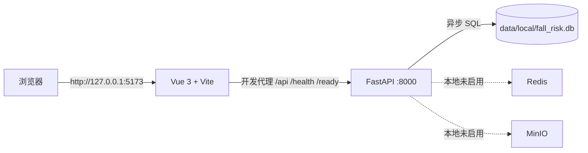

# 第一阶段无 Docker 本地运行手册（Windows）

## 1. 适用范围

本手册用于在 Windows 电脑上直接运行第一阶段平台，不安装 Docker，也不启动 MySQL、Redis 或 MinIO。

轻量本地模式已经具备：

- Vue 3 管理端；
- FastAPI API；
- SQLite 本地数据库；
- 管理员登录、会话刷新、当前用户查询和退出；
- API 存活检查与轻量模式就绪检查。

Redis 和 MinIO 在第一阶段尚未承载业务数据，因此轻量模式会将它们明确标记为“本地未启用”。这不是故障，也不会阻止平台进入就绪状态。后续阶段接入设备 Token、任务调度、事件截图或录像时，应切换到完整模式，或给这些服务配置独立的本地/远程实例。

本文不包含自动化测试。

## 2. 轻量本地架构



本地需要两个 PowerShell 终端：一个运行 API，一个运行前端。Vite 将浏览器发出的 API 请求代理到 `127.0.0.1:8000`，因此浏览器仍只需打开前端地址。

## 3. 前置环境

需要：

- Python 3.12；
- Node.js 22 LTS 或更新的 LTS 版本；
- PowerShell；
- 项目根目录下的 Python 虚拟环境 `.venv`；
- `apps/web/node_modules` 前端依赖目录。

在项目根目录检查运行时：

```powershell
python --version
node --version
npm --version
```

如果本机命令行暂时找不到 Node.js，但安装在默认目录，可重新打开 PowerShell；项目的 Web 启动脚本也会自动尝试 `C:\Program Files\nodejs\npm.cmd`。

### 3.1 仅在 `.venv` 不存在时执行

```powershell
python -m venv .venv
.\.venv\Scripts\python.exe -m pip install -r .\services\api\requirements.txt
```

### 3.2 仅在 `apps/web/node_modules` 不存在时执行

```powershell
Set-Location .\apps\web
npm install
Set-Location ..\..
```

依赖安装需要联网，但之后正常启动平台不需要联网。

## 4. 首次配置

在项目根目录执行：

```powershell
Copy-Item .\services\api\local.env.example .\services\api\.env
notepad .\services\api\.env
```

至少替换以下两个占位值：

```dotenv
JWT_SECRET=请改成至少32个字符的随机字符串
INITIAL_ADMIN_PASSWORD=请改成至少12个字符的管理员密码
```

默认管理员用户名是 `admin`，可修改 `INITIAL_ADMIN_USERNAME`。不要把 `services/api/.env` 提交到 Git；仓库已将所有 `.env` 文件排除。

关键配置含义：

- `DATABASE_URL=sqlite+aiosqlite:///../../data/local/fall_risk.db`：把数据写到项目的 `data/local`；
- `LOCAL_LIGHTWEIGHT_MODE=true`：不连接 Redis 和 MinIO；
- `COOKIE_SECURE=false`：允许本地 HTTP 开发环境写入刷新 Cookie；
- `AUTO_CREATE_TABLES=false`：由 Alembic 迁移管理数据库结构。

## 5. 启动平台

### 5.1 终端 A：启动 API

在项目根目录执行：

```powershell
Set-ExecutionPolicy -Scope Process -ExecutionPolicy Bypass
& .\scripts\start-local-api.ps1
```

第一条命令只调整当前 PowerShell 窗口的执行策略，关闭窗口后自动失效，不会修改系统全局策略。如果终端提示找不到 `powershell`，也直接使用上面两条命令，因为当前窗口本身已经是 PowerShell，不需要再启动一个 `powershell.exe`。

脚本依次完成数据库迁移、首次管理员创建，然后启动 API：

- API：<http://127.0.0.1:8000>
- 接口文档：<http://127.0.0.1:8000/docs>
- 存活检查：<http://127.0.0.1:8000/health>
- 就绪检查：<http://127.0.0.1:8000/ready>

第一次成功启动后会出现 `data/local/fall_risk.db`。如果管理员已存在，后续启动不会覆盖其密码。

### 5.2 终端 B：启动 Web

保持 API 终端运行，打开第二个 PowerShell，在项目根目录执行：

```powershell
Set-ExecutionPolicy -Scope Process -ExecutionPolicy Bypass
& .\scripts\start-local-web.ps1
```

浏览器打开 <http://127.0.0.1:5173>，使用 `.env` 中的管理员用户名和密码登录。

页面正常时应看到：

- 总体状态为“轻量本地模式就绪”；
- SQLite 对应的数据库状态为“运行正常”；
- Redis 和 MinIO 状态为“本地未启用”；
- 第二阶段及以后功能仍显示 `--` 或“待开放”。

## 6. 停止与再次启动

在两个终端中分别按 `Ctrl+C` 停止服务。再次运行时仍执行同样的两个脚本即可，已有 SQLite 数据会保留。

不要在 API 运行期间移动或删除 `data/local/fall_risk.db`。如确实要清空本地账号和会话数据，应先停止 API，备份后再手工删除这一个数据库文件；下一次启动脚本会重新建表并创建初始管理员。

## 7. 本模式新增文件的作用

- `services/api/local.env.example`：无 Docker 配置模板；
- `services/api/.env`：你的本地实际配置和密钥，不进入 Git；
- `scripts/start-local-api.ps1`：建目录、迁移数据库、初始化管理员并启动 FastAPI；
- `scripts/start-local-web.ps1`：检查 Node.js 与依赖并启动 Vite；
- `data/local/fall_risk.db`：SQLite 运行数据，不进入 Git；
- `services/api/app/core/config.py`：读取 `LOCAL_LIGHTWEIGHT_MODE`；
- `services/api/app/modules/system/router.py`：按完整或轻量模式计算就绪状态；
- `apps/web/src/views/DashboardView.vue`：显示轻量模式和依赖状态。

完整模式的目录与所有第一阶段文件职责见 [phase1-local-user-guide.md](./phase1-local-user-guide.md)。

## 8. 常见问题

### 启动脚本提示仍有 `replace-with-*`

编辑 `services/api/.env`，将 `JWT_SECRET` 和 `INITIAL_ADMIN_PASSWORD` 的占位值全部替换后重试。

### 提示无法识别 `powershell`

这表示 Windows PowerShell 的安装目录没有加入当前终端的 `PATH`，并不表示 PowerShell 没有安装。如果命令提示符以 `PS` 开头，说明已经在 PowerShell 中，直接执行：

```powershell
Set-ExecutionPolicy -Scope Process -ExecutionPolicy Bypass
& .\scripts\start-local-api.ps1
```

若必须从其他程序显式启动 Windows PowerShell，可使用完整路径：

```powershell
& "$env:SystemRoot\System32\WindowsPowerShell\v1.0\powershell.exe" -ExecutionPolicy Bypass -File .\scripts\start-local-api.ps1
```

### API 提示端口 8000 被占用

先停止之前启动的 API 终端。前端代理固定使用 8000，不建议只修改 API 端口。

### Web 提示端口 5173 被占用

先停止之前启动的 Vite 终端或占用该端口的其他进程。

### 登录密码改了但仍然使用旧密码

初始化程序只创建不存在的管理员，不会用 `.env` 覆盖已有账户。需要保留数据时应通过后续的改密功能处理；第一阶段本地演示若不需要保留数据，可按第 6 节先备份并重建 SQLite 数据库。

### `/ready` 中 Redis 和 MinIO 是 `disabled`

这是轻量模式的预期结果。只要数据库为 `ok`，总体状态仍为 `ready`。
