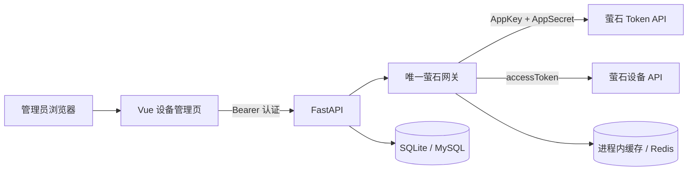

# 第二阶段：萤石 Token 与设备管理使用说明

## 1. 阶段目标

第二阶段完成以下能力：

- 后端统一封装萤石开放平台接口；
- 服务端获取并缓存 accessToken；
- Token 临近过期时提前刷新；
- 同一进程或多进程下避免重复并发刷新；
- Token 失效时强制刷新并重试一次；
- 同步设备和通道信息到本地数据库；
- 查询单台设备的实时在线和加密状态；
- 提供仅管理员可访问的设备管理页面；
- 浏览器只接收脱敏设备序列号。
- 页面只显示 Token 是否已缓存、最近获取时间和到期时间，不返回 Token 正文。

本阶段不包含套餐激活、视频播放、设备验证码管理或 AI 推理。

## 2. 运行架构



两种本地模式：

- 当前无 Docker 轻量模式：Token 使用 API 进程内缓存和异步锁；API 重启后重新获取 Token，适合单机开发；
- Docker 完整模式：Token 使用 Redis 缓存和分布式锁，适合多进程或多实例运行。

数据库只保存设备、通道和同步状态，不保存 AppSecret、完整 accessToken 或设备验证码。

## 3. 数据库变化

第二阶段新增：

- `devices`：设备名称、型号、在线状态、加密状态、通道数和同步时间；
- `device_channels`：通道号、名称、在线状态、加密状态和清晰度；
- Alembic 版本 `20260813_0002`。

已经存在的第一阶段 SQLite 数据库可以直接升级，不需要删除或重建。

## 4. 配置萤石凭证

登录萤石开放平台，在应用密钥页面取得当前应用的 AppKey 和 AppSecret。确认设备已经添加或授权到该应用对应账号。

停止正在运行的 API，然后编辑：

```text
services/api/.env
```

追加或修改：

```dotenv
EZVIZ_API_BASE_URL=https://open.ys7.com
EZVIZ_APP_KEY=你的AppKey
EZVIZ_APP_SECRET=你的AppSecret
EZVIZ_REQUEST_TIMEOUT_SECONDS=10
EZVIZ_TOKEN_REFRESH_SKEW_SECONDS=600
EZVIZ_TOKEN_LOCK_TIMEOUT_SECONDS=15
EZVIZ_DEVICE_SYNC_PAGE_SIZE=50
```

安全要求：

- 不要把真实值写入 `local.env.example`、README 或前端源码；
- 不要把 `.env` 上传 Git；
- 不要截图或复制带有完整 AppSecret、accessToken 的日志；
- 不要把设备验证码加入本阶段配置。

如果暂时没有凭证，可以继续启动平台并查看设备页；页面会显示“待配置”，不会生成模拟设备。

## 5. 启动与数据库升级

停止旧的前后端进程后，按日常方式重新启动。

终端 A：

```powershell
Set-Location F:\fall-risk-platform
Set-ExecutionPolicy -Scope Process -ExecutionPolicy Bypass -Force
& .\scripts\start-local-api.ps1
```

API 启动脚本会自动执行：

```text
20260807_0001 -> 20260813_0002
```

终端 B：

```powershell
Set-Location F:\fall-risk-platform
Set-ExecutionPolicy -Scope Process -ExecutionPolicy Bypass -Force
& .\scripts\start-local-web.ps1
```

打开 <http://127.0.0.1:5173>，登录管理员账号，在左侧选择“设备管理”。

## 6. 页面操作

### 同步萤石设备

点击“同步萤石设备”。后端会：

1. 获取缓存 Token；
2. Token 不存在或临近过期时调用官方 Token 接口；
3. 分页获取设备和通道；
4. 新增或更新本地记录；
5. 将本次官方列表中不存在的旧设备标记为非当前设备，而不是物理删除；
6. 返回新增、更新、缺失和通道数量。

同步成功后页面显示设备名称、脱敏序列号、型号、在线状态、加密状态、通道数和最近同步时间。

### 刷新单台状态

点击设备行的“刷新状态”，后端使用完整设备序列号调用官方设备信息接口，只向页面返回脱敏序列号和最新状态。

### 页面状态解释

- `在线`：官方接口本次返回在线；
- `离线`：官方接口本次返回离线；
- `未知`：官方字段缺失或值无法可靠映射；
- `待配置`：服务端未设置 AppKey/AppSecret；
- `Token 缓存：本机内存`：当前为无 Docker 单进程模式；
- `Token 缓存：Redis`：当前为完整模式。
- `等待首次认证`：凭证已配置，但 API 进程还没有触发 Token 请求；
- `认证有效`：后端缓存了仍在有效期内的 Token；
- `等待自动刷新`：缓存即将到期或已过期，下次萤石请求会自动刷新。

## 7. 后端接口

所有接口位于 `/api/v1`，需要登录；当前第二阶段仅管理员可用。

- `GET /devices/integration`：配置状态、缓存模式、设备计数、最近同步时间；
- `POST /devices/sync`：同步设备与通道；
- `GET /devices`：读取本地设备列表；
- `GET /devices/{id}`：读取单台本地设备和通道；
- `GET /devices/{id}/status`：从萤石实时刷新单台设备状态。

接口响应不会包含 AppKey、AppSecret、accessToken、设备验证码或完整设备序列号。

## 8. 人工验收步骤

### 未配置凭证

1. 保持 `.env` 中 `EZVIZ_APP_KEY` 和 `EZVIZ_APP_SECRET` 为空；
2. 重启 API；
3. 打开设备管理页；
4. 确认显示“待配置”，同步按钮不可用且列表不出现模拟数据。

### 真实账号与设备

1. 在 `.env` 写入真实 AppKey/AppSecret；
2. 重启 API；
3. 点击“同步萤石设备”；
4. 对照萤石开放平台确认设备数量、名称、型号和通道；
5. 确认页面序列号已脱敏；
6. 分别在设备在线、离线时点击“刷新状态”；
7. 确认状态与官方平台一致；
8. 再次同步，确认设备不会重复创建；
9. 检查浏览器网络响应和后端日志，确认没有 AppSecret 或完整 accessToken。

只有完成真实账号和真实设备步骤后，才能将“萤石设备接入”标记为真实集成验收通过。

## 9. 常见问题

### 配置凭证后页面仍显示“待配置”

`.env` 只在 API 启动时读取。停止并重新启动 API，然后刷新页面。

### 同步返回 409

表示 AppKey/AppSecret 未同时配置。二者必须成对填写。

### 同步返回 502

表示萤石上游拒绝请求、Token 重试后仍无效，或返回格式异常。检查：

- AppKey/AppSecret 是否属于同一应用；
- 设备是否属于或已授权给该应用账号；
- 电脑网络能否访问 `open.ys7.com`；
- 萤石开放平台控制台是否提示权限或账号问题。

### API 重启后为什么重新获取 Token

无 Docker 轻量模式使用进程内缓存，重启进程后缓存自然清空。这不影响正确性。完整模式使用 Redis，可跨 API 重启保留 Token。

### 修改 `.env` 会不会把 AppSecret 发给前端

不会。凭证只由后端配置对象读取，设备接口的响应模型没有任何密钥字段。
