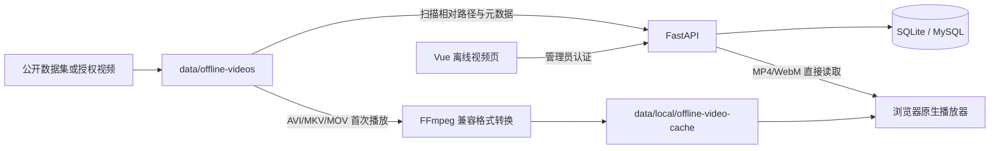

# 第二阶段 A：离线视频模拟使用说明

## 1. 适用场景

当前没有萤石摄像机时，可以使用公开跌倒数据集、公开居家活动数据或已经取得拍摄授权的本地视频，先验证平台的媒体输入和回放链路。

该模式具有明确边界：

- 不生成虚假的萤石设备、序列号或在线状态；
- 不调用萤石 Token、设备同步或取流接口；
- 不代表比赛要求的真实萤石平台实测；
- 本阶段没有 AI 推理、跌倒识别、风险评分或告警；
- 后续 AI 模块将复用同一输入接口，再增加萤石云视频源。

## 2. 运行架构



数据库只保存相对路径、大小、数据来源、动作标签和许可说明。视频文件仍位于本机目录中，不会写入数据库，也不会加入 Git。

## 3. 支持的数据与格式

当前支持：

- `.mp4`；
- `.webm`；
- `.mov`；
- `.mkv`；
- `.avi`。

“能够扫描”不等于浏览器原生支持其中的容器和编码。平台会直接播放 `.mp4`、`.webm`；`.avi`、`.mkv`、`.mov` 首次点击“模拟运行”时由后端自动转换为 `H.264 + AAC` 的 MP4，并缓存到 `data/local/offline-video-cache`。首次准备可能需要等待，之后会复用缓存，不修改原视频。缓存和原始视频均已排除在 Git 之外。

建议从作者、高校或正式数据仓库下载，例如：

- [GMDCSA-24 官方 GitHub](https://github.com/ekramalam/GMDCSA24-A-Dataset-for-Human-Fall-Detection-in-Videos)；
- [GMDCSA-24 Zenodo 版本](https://zenodo.org/records/12921216)；
- [CAUCAFall 数据说明与下载地址](https://pmc.ncbi.nlm.nih.gov/articles/PMC9508401/)；
- [UR Fall Detection Dataset](https://fenix.ur.edu.pl/~mkepski/ds/uf.html)。

不要使用来源不明、没有授权或包含真实家庭隐私的视频。下载后保留数据版本、来源链接、许可证和引用论文。

## 4. 准备目录

默认目录为：

```text
F:\fall-risk-platform\data\offline-videos
```

推荐按照“数据集/动作标签/视频”的结构放置：

```text
data/offline-videos/
├─ GMDCSA-24/
│  ├─ Fall/
│  │  ├─ fall-01.mp4
│  │  └─ fall-02.mp4
│  └─ ADL/
│     ├─ sleeping-01.mp4
│     └─ walking-01.mp4
└─ My-Authorized-Clips/
   └─ NearFall/
      └─ stumble-01.mp4
```

扫描时会尝试识别以下目录或文件名：

- `Fall`：跌倒；
- `ADL`、`NoFall`、`NonFall`、`Normal`：日常活动；
- `NearFall`、`PreFall`：近跌倒；
- 无法判断：待标注。

自动识别只是初始值，必须在页面中人工检查。

## 5. 本地配置

`services/api/.env` 默认包含：

```dotenv
OFFLINE_VIDEO_ROOT=../../data/offline-videos
OFFLINE_VIDEO_CACHE_ROOT=../../data/local/offline-video-cache
OFFLINE_PLAYBACK_TICKET_EXPIRE_SECONDS=1800
OFFLINE_VIDEO_TRANSCODE_TIMEOUT_SECONDS=300
```

路径以 `services/api` 为当前目录解析。播放票据允许设置为 60 至 3600 秒，不建议作为长期链接使用；兼容格式转换超时允许设置为 30 至 1800 秒。

## 6. 启动平台

停止旧的 API 和前端进程，然后在项目根目录打开两个 PowerShell 终端。

终端 A：

```powershell
Set-Location F:\fall-risk-platform
Set-ExecutionPolicy -Scope Process -ExecutionPolicy Bypass -Force
& .\scripts\start-local-api.ps1
```

启动脚本会自动把数据库升级到 `20260815_0003`，不会删除已有用户或设备数据。

终端 B：

```powershell
Set-Location F:\fall-risk-platform
Set-ExecutionPolicy -Scope Process -ExecutionPolicy Bypass -Force
& .\scripts\start-local-web.ps1
```

打开 <http://127.0.0.1:5173>，使用管理员账号登录，在左侧选择“离线视频”。

## 7. 页面使用步骤

1. 将视频复制到 `data/offline-videos` 的数据集子目录；
2. 点击“扫描视频目录”；
3. 对照数据集说明检查视频数量、数据集名称和动作标签；
4. 点击“编辑”，填写数据来源、官方来源地址和许可说明；
5. 点击“模拟运行”，使用浏览器播放器查看视频；非 MP4/WebM 素材首次运行会先显示按钮加载状态，完成兼容格式转换后自动播放；
6. 使用 `1.0× 实时` 验证实际播放节奏，也可以切换倍速检查素材；
7. 移动或删除文件后重新扫描，旧记录会显示“已缺失”，平台不会替你删除文件。

页面刷新或临时播放地址过期后，再次点击“模拟运行”即可取得新地址。

如果后端日志显示流接口返回 `206 Partial Content`，只代表浏览器成功执行了分段读取，并不代表源编码一定能解码。当前版本会在签发播放票据前准备兼容 MP4；若转换失败，页面会显示源文件损坏、无视频轨或超时等错误。修改配置或升级此功能后，需要停止旧 API（`Ctrl+C`）并重新运行启动脚本。

## 8. 数据字段说明

- `数据集名称`：例如 `GMDCSA-24`、`CAUCAFall`；
- `数据来源`：公开数据集、自行采集、合成数据或未确认；
- `动作标签`：跌倒、日常活动、近跌倒或待标注；
- `官方来源地址`：作者页面、Zenodo、Mendeley Data 等正式地址；
- `许可与引用说明`：许可证、论文引用要求和用途限制；
- `文件状态`：当前相对路径是否仍能在本机找到。

## 9. 当前限制与后续衔接

浏览器能够播放视频只说明媒体链路可用，不能说明已经识别出跌倒。下一阶段会在现有 `offline_video` 输入源上接入：

1. FFmpeg 或 OpenCV 解码；
2. 人体检测与姿态关键点；
3. 连续帧时序特征；
4. 跌倒、日常活动和近跌倒状态判断；
5. 事件级召回率、误报和响应时间评估。

取得萤石摄像机后，再增加 `ezviz_cloud` 输入源，并使用萤石云取得的视频完成最终平台集成证据。公开数据离线结果和萤石实测结果必须分别报告。
