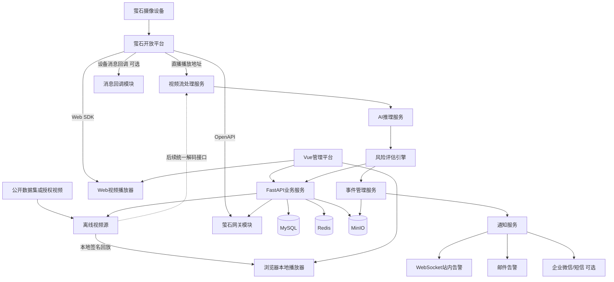
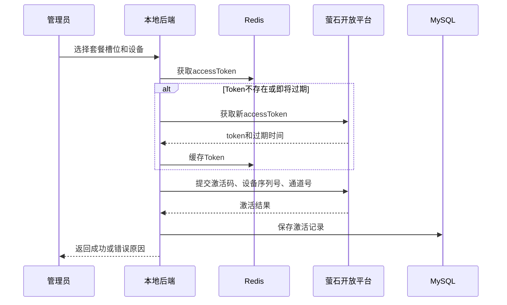
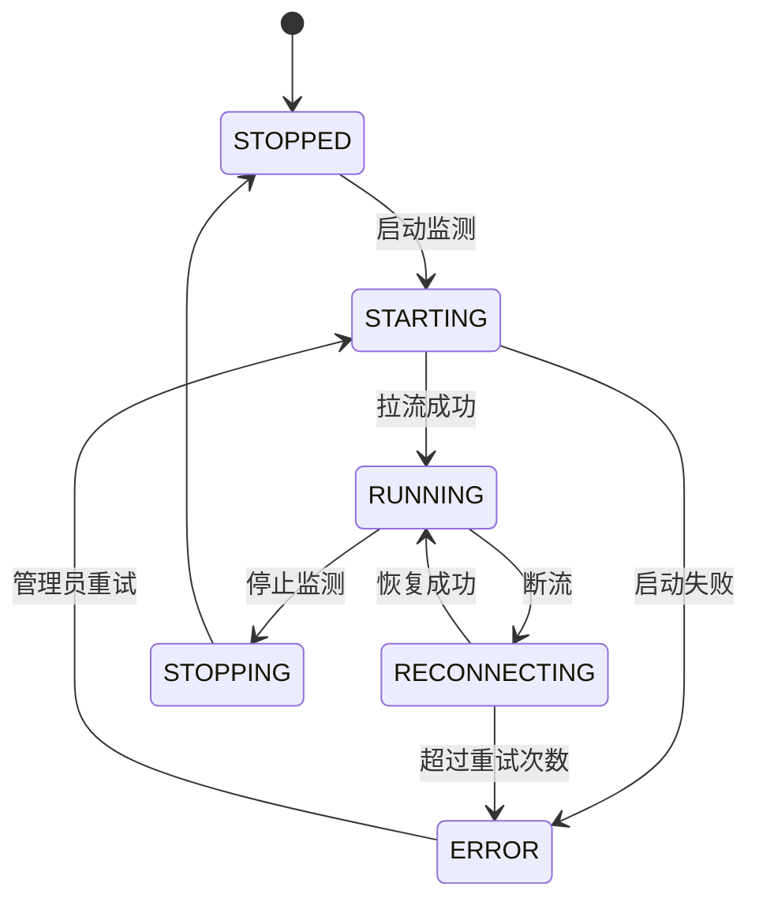
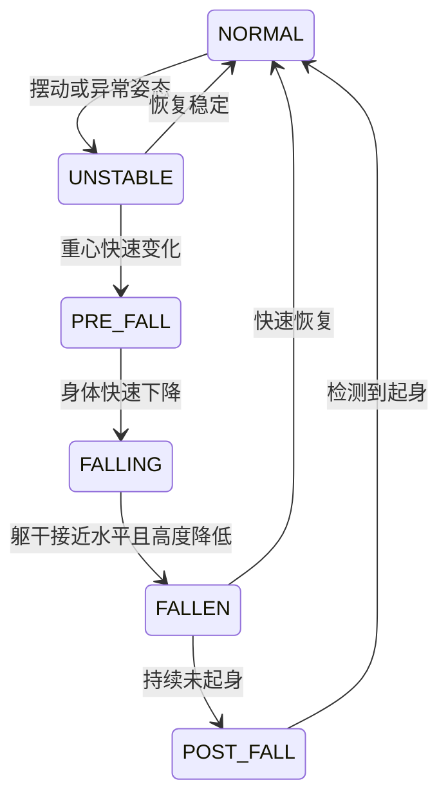

当前已获得 **5 个揭榜挂帅专属设备套餐激活码**，数量与通知中的“5个设备套餐”一致，套餐有效期为6个月；但当前没有可绑定的萤石摄像机。激活码只有在提交实际设备序列号和通道号，并收到 `activeCode=0` 后才能确认激活成功。一个激活码只激活一个设备通道。([萤石社区][1]) 激活码按敏感信息管理，不得放入方案、前端代码、Git 仓库或普通日志。

新版方案严格按照官方资源边界设计：核心设备接入和音视频能力最终通过萤石开放平台 API/SDK 实现；AI 模型在团队自己的服务器上运行；基础版本不依赖云录制、官方 AI 等额外付费服务。官方允许团队自行选择 Python、PyTorch 等开发环境，但要求以萤石开放平台为前提，原则上完成设备接入并调用核心音视频 API/SDK；官方不提供训练数据集。([萤石社区][2]) 在暂时没有硬件时，项目使用公开数据集完成离线研发，但不得把离线结果表述为萤石平台实测。自研模型最终仍需使用从萤石云取得的视频数据完成平台链路验证。([萤石社区][4])

# 基于萤石开放平台的老年人跌倒风险预测与智能预警平台

## 软件系统详细开发设计规格书

**文档用途：** 供编程助手、系统开发人员和算法开发人员直接实施
**项目性质：** 2026年度中国青年科技创新“揭榜挂帅”擂台赛技术攻关项目
**当前资源：** 5个萤石赛事专属设备套餐激活码；当前无萤石摄像机
**版本：** V2.1
**设计原则：** 离线数据先完成可复现研发，萤石云数据完成最终集成验证，增值服务按需启用

---

# 一、项目建设目标

本项目建设一套基于萤石开放平台的老年人跌倒风险预测与智能预警软件平台。平台通过萤石摄像设备采集老年人日常活动视频，调用萤石开放平台完成设备接入、设备状态查询、音视频播放地址获取和视频播放，并在团队自建服务器中完成视频解码、人体姿态分析、跌倒检测、跌倒前异常状态识别、长期风险评估和告警管理。

平台不应只实现“跌倒已经发生后的检测”，而应形成以下完整闭环：

```text
萤石设备接入
    ↓
实时视频取流
    ↓
人体检测与姿态估计
    ↓
短期异常动作识别
    ↓
长期步态与稳定性分析
    ↓
跌倒风险评分
    ↓
跌倒事件确认
    ↓
事件录像保存
    ↓
家属及管理人员告警
    ↓
事件处理与风险趋势分析
```

系统最终需要实现：

1. 五路以内萤石设备统一接入和管理；
2. Web端实时视频播放；
3. 设备在线状态及套餐激活状态管理；
4. 视频流实时AI分析；
5. 人体骨架、检测框和风险信息可视化；
6. 跌倒及疑似跌倒事件检测；
7. 老年人跌倒风险连续评分；
8. 事件前后录像自动保存；
9. 告警确认、处理和追踪；
10. 日、周、月风险趋势统计；
11. 面向家属、护理人员和管理员的权限管理；
12. 后续支持毫米波雷达、智能手环等多模态设备扩展。

---

# 二、官方资源边界与系统设计调整

## 2.1 已获得资源

当前团队已获得：

| 资源         |    数量 |     有效期 | 主要作用                    |
| ---------- | ----: | ------: | ----------------------- |
| 揭榜挂帅专属设备套餐 |    5个 |     6个月 | 设备接入、基础视频取流             |
| 套餐激活码      |    5条 | 以官方后台为准 | 绑定指定设备序列号和通道            |
| 萤石开放平台账号   |    1个 | 以账号状态为准 | 获取AppKey、AppSecret和接口权限 |
| 萤石开放平台API  | 按账号权限 |   以套餐为准 | Token、设备管理、状态查询、取流      |
| 音视频SDK     | 按平台权限 | 以官方版本为准 | Web或客户端视频播放             |

## 2.2 不应默认认为已经获得的资源

以下服务不能因为获得设备套餐就默认已经开通：

* 云录制；
* 云存储；
* 云端AI识别；
* 图片抽帧；
* 视频剪辑；
* 付费消息服务；
* 额外带宽；
* 第三方短信；
* 第三方电话告警。

系统必须先实现一个**不依赖上述付费资源的基础版本**。云录制、云AI等能力只有在后台明确显示已领取代金券、试用权益或充值余额后才能启用。

## 2.3 两级运行模式

### 基础运行模式

只使用设备套餐所提供的设备接入和基础取流能力：

* 萤石API管理设备；
* 萤石SDK播放视频；
* 使用萤石播放地址供服务器分析；
* 本地AI服务器推理；
* 本地MinIO保存事件录像；
* 本地数据库保存风险结果；
* 自建WebSocket、邮件或企业微信告警。

基础模式必须能够独立完成比赛演示。

### 增强运行模式

只有确认增值权益后才启用：

* 云录制；
* 云存储；
* 萤石设备消息推送；
* 云端抽帧；
* 云端视频剪辑；
* 官方AI服务；
* 其他收费平台能力。

所有增强功能必须通过配置开关控制，不得写死在系统中。

```yaml
features:
  cloud_recording: false
  ezviz_message_push: false
  ezviz_cloud_ai: false
  local_event_recording: true
  local_ai_inference: true
```

---

# 三、总体技术架构

## 3.1 技术选型

为降低学生团队开发和部署复杂度，采用以下技术栈：

| 层级        | 技术                                 |
| --------- | ---------------------------------- |
| Web前端     | Vue 3、TypeScript、Vite、Element Plus |
| 状态管理      | Pinia                              |
| 图表展示      | ECharts                            |
| 视频播放      | 萤石Web/H5 SDK或官方播放器组件               |
| 后端API     | FastAPI、Python 3.11                |
| AI推理服务    | PyTorch、OpenCV、FFmpeg              |
| 人体检测与姿态估计 | YOLO Pose基线，预留RTMPose适配器           |
| 人体跟踪      | ByteTrack                          |
| 时序模型      | TCN或GRU，后续可替换为ST-GCN或Transformer   |
| 异步任务      | Celery或RQ                          |
| 缓存与任务队列   | Redis                              |
| 业务数据库     | MySQL 8                            |
| 文件和录像存储   | MinIO                              |
| 容器化       | Docker、Docker Compose              |
| 反向代理      | Nginx                              |
| 系统监控      | Prometheus、Grafana，可作为后期功能         |
| 日志        | Python Logging或Loguru，JSON结构化日志    |

## 3.2 总体架构



## 3.3 架构实施原则

比赛版本不采用大量独立微服务，避免增加部署复杂度。

推荐采用：

```text
一个Web前端
一个业务后端
一个AI推理服务
一个视频流工作进程
MySQL + Redis + MinIO
```

其中业务后端内部采用模块化设计，后续可按需求拆分成独立服务。

---

# 四、项目目录结构

编程助手应按照以下单仓库结构创建项目：

```text
fall-risk-platform/
├── README.md
├── .env.example
├── .gitignore
├── docker-compose.yml
├── Makefile
│
├── apps/
│   └── web/
│       ├── src/
│       │   ├── api/
│       │   ├── assets/
│       │   ├── components/
│       │   ├── layouts/
│       │   ├── router/
│       │   ├── stores/
│       │   ├── types/
│       │   ├── utils/
│       │   └── views/
│       ├── package.json
│       └── vite.config.ts
│
├── services/
│   ├── api/
│   │   ├── app/
│   │   │   ├── main.py
│   │   │   ├── core/
│   │   │   ├── models/
│   │   │   ├── schemas/
│   │   │   ├── repositories/
│   │   │   ├── modules/
│   │   │   │   ├── auth/
│   │   │   │   ├── elders/
│   │   │   │   ├── devices/
│   │   │   │   ├── ezviz/
│   │   │   │   ├── monitoring/
│   │   │   │   ├── risks/
│   │   │   │   ├── events/
│   │   │   │   ├── alerts/
│   │   │   │   ├── reports/
│   │   │   │   └── system/
│   │   │   └── workers/
│   │   ├── tests/
│   │   └── requirements.txt
│   │
│   ├── ai/
│   │   ├── app/
│   │   │   ├── main.py
│   │   │   ├── inference/
│   │   │   ├── pose/
│   │   │   ├── tracking/
│   │   │   ├── features/
│   │   │   ├── temporal/
│   │   │   ├── risk/
│   │   │   └── models/
│   │   ├── weights/
│   │   ├── tests/
│   │   └── requirements.txt
│   │
│   └── stream-worker/
│       ├── app/
│       │   ├── stream_manager.py
│       │   ├── ffmpeg_reader.py
│       │   ├── ring_buffer.py
│       │   └── health_check.py
│       └── requirements.txt
│
├── packages/
│   ├── contracts/
│   └── shared/
│
├── infra/
│   ├── nginx/
│   ├── mysql/
│   ├── minio/
│   └── scripts/
│
├── docs/
│   ├── architecture.md
│   ├── api.md
│   ├── database.md
│   ├── deployment.md
│   └── ezviz-integration.md
│
└── data/
    ├── samples/
    ├── annotations/
    └── exports/
```

---

# 五、萤石开放平台接入设计

## 5.1 密钥管理

系统所需敏感配置：

```dotenv
EZVIZ_APP_KEY=
EZVIZ_APP_SECRET=

MYSQL_HOST=mysql
MYSQL_PORT=3306
MYSQL_DATABASE=fall_risk
MYSQL_USER=fall_user
MYSQL_PASSWORD=

REDIS_URL=redis://redis:6379/0

MINIO_ENDPOINT=minio:9000
MINIO_ACCESS_KEY=
MINIO_SECRET_KEY=

JWT_SECRET=
DATA_ENCRYPTION_KEY=
```

激活码单独管理：

```dotenv
EZVIZ_PACKAGE_CODE_01=
EZVIZ_PACKAGE_CODE_02=
EZVIZ_PACKAGE_CODE_03=
EZVIZ_PACKAGE_CODE_04=
EZVIZ_PACKAGE_CODE_05=
```

要求：

1. `.env`必须加入`.gitignore`；
2. 前端不得保存AppSecret；
3. AppSecret不得返回给浏览器；
4. 激活码只允许管理员激活接口读取；
5. 激活成功后，应从环境变量迁移到安全备份并停止在运行环境中长期保留；
6. 日志中只能显示激活码最后4位；
7. 数据库中如需保存激活码，只保存加密值或不可逆摘要。

## 5.2 accessToken管理

后端建立统一的`EzvizTokenManager`：

```python
class EzvizTokenManager:
    async def get_valid_token(self) -> str:
        """
        1. 从Redis读取token
        2. 判断expire_time
        3. 若即将过期，则加分布式锁刷新
        4. 返回有效token
        """

    async def refresh_token(self) -> str:
        """
        调用萤石Token接口
        保存accessToken和expireTime
        """
```

Token获取接口：

```text
POST https://open.ys7.com/api/lapp/token/get
Content-Type: application/x-www-form-urlencoded

appKey=...
appSecret=...
```

Token缓存结构：

```json
{
  "access_token": "******",
  "expire_time": 0,
  "refreshed_at": "2026-08-02T13:00:00+08:00"
}
```

刷新策略：

* 不在每次请求时重新获取Token；
* 提前10分钟刷新；
* 使用Redis锁避免多个进程同时刷新；
* 接口返回Token异常时，强制刷新并重试一次；
* 连续失败时停止重试并告警；
* Token绝不写入普通日志。

## 5.3 设备套餐激活

官方激活接口：

```text
POST https://open.ys7.com/api/v3/mall/device/package/code/active
```

请求头：

```text
accessToken: {有效的accessToken}
Content-Type: application/json
```

请求体直接传数组：

```json
[
  {
    "packageDeviceId": "${EZVIZ_PACKAGE_CODE_01}",
    "deviceSerial": "实际设备序列号",
    "channelNo": "1"
  }
]
```

后端管理接口：

```text
POST /api/v1/admin/ezviz/packages/activate
```

请求参数：

```json
{
  "package_slot": 1,
  "device_serial": "XXXXXXXXX",
  "channel_no": 1
}
```

禁止由浏览器直接提交完整激活码。浏览器只传`package_slot`，后端根据槽位读取本地环境变量。

激活结果判断：

```python
success = (
    response["meta"]["code"] == 200
    and all(item["activeCode"] == 0 for item in response["data"])
)
```

激活记录表必须保存：

* 套餐槽位；
* 设备序列号；
* 通道号；
* 激活时间；
* 激活状态；
* 官方返回状态码；
* 官方返回信息；
* 操作管理员；
* 套餐码后4位；
* 重试次数。

## 5.4 激活操作流程



## 5.5 激活前检查

激活前必须完成：

1. 确认设备已经添加到对应萤石开放平台账号；
2. 确认设备序列号无误；
3. 确认设备通道号；
4. 确认设备在线；
5. 确认设备未绑定其他套餐；
6. 确认套餐槽位未使用；
7. 对激活接口设置幂等保护；
8. 管理员二次确认后才能提交。

幂等键：

```text
package_slot + device_serial + channel_no
```

同一幂等键不允许重复调用激活接口。

## 5.6 设备同步

系统应定时同步：

* 设备序列号；
* 设备名称；
* 设备型号；
* 通道列表；
* 在线状态；
* 视频加密状态；
* 设备绑定状态；
* 最后在线时间；
* 最后同步时间。

设备同步任务：

```text
任务名称：sync_ezviz_devices
执行频率：每5分钟
失败重试：3次
重试间隔：30秒、60秒、120秒
```

设备状态检查：

```text
任务名称：check_device_status
执行频率：每60秒
```

## 5.7 视频播放地址

后端统一封装播放地址获取逻辑：

```python
class EzvizStreamService:
    async def get_play_url(
        self,
        device_serial: str,
        channel_no: int,
        protocol: str,
        quality: str
    ) -> PlayUrl:
        ...
```

后端接口：

```text
POST /api/v1/devices/{device_id}/play-url
```

请求：

```json
{
  "protocol": "ezopen",
  "quality": "standard",
  "purpose": "web_playback"
}
```

AI取流请求：

```json
{
  "protocol": "rtmp",
  "quality": "standard",
  "purpose": "ai_inference"
}
```

协议使用原则：

| 场景      | 首选协议          | 备用协议   |
| ------- | ------------- | ------ |
| Web实时预览 | EZOPEN官方SDK   | HLS    |
| AI服务器取流 | RTMP或HTTP-FLV | HLS    |
| 历史回放    | 官方SDK回放       | 本地事件录像 |
| 移动端     | 官方移动端SDK      | HLS    |

播放地址不得永久保存在数据库。数据库只保存：

* 请求时间；
* 设备；
* 协议；
* 用途；
* 过期时间；
* 获取是否成功。

## 5.8 Web视频播放

浏览器不得自行拼接萤石接口。

流程：

```text
前端请求播放会话
    ↓
后端校验用户是否有权查看该老人
    ↓
后端获取有效播放凭证
    ↓
后端返回播放所需最小参数
    ↓
前端创建萤石播放器实例
    ↓
播放器开始播放
```

前端组件：

```text
EzvizPlayer.vue
```

组件属性：

```typescript
interface EzvizPlayerProps {
  deviceId: number
  channelNo: number
  autoplay?: boolean
  muted?: boolean
  showControls?: boolean
}
```

组件事件：

```typescript
interface EzvizPlayerEvents {
  onReady: () => void
  onPlay: () => void
  onStop: () => void
  onError: (code: string, message: string) => void
  onSnapshot: (url: string) => void
}
```

播放器离开页面后必须：

* 停止播放；
* 销毁播放器实例；
* 释放定时器；
* 关闭WebSocket；
* 清理播放地址；
* 不在LocalStorage中保存Token。

---

# 六、视频流处理服务设计

## 6.1 服务职责

`stream-worker`负责：

1. 获取AI分析用播放地址；
2. 启动FFmpeg；
3. 解码视频帧；
4. 控制采样帧率；
5. 维护断线重连；
6. 向AI服务发送帧；
7. 建立事件录像环形缓冲区；
8. 上报流健康状态。

## 6.2 视频分析参数

初始建议：

```yaml
stream:
  input_resolution: auto
  inference_width: 640
  inference_height: 360
  target_fps: 10
  reconnect_interval_seconds: 5
  max_reconnect_attempts: 10
  frame_queue_size: 5
  drop_old_frames: true
```

原则：

* 实时系统不允许无限积压帧；
* 当AI处理速度不足时丢弃旧帧；
* 优先保证低延迟，而不是逐帧完整分析；
* Web播放和AI分析使用独立会话；
* 不允许通过浏览器截屏后再发给AI。

## 6.3 流状态机



状态数据：

```json
{
  "device_id": 1,
  "status": "RUNNING",
  "input_fps": 20.0,
  "inference_fps": 10.0,
  "frame_delay_ms": 160,
  "reconnect_count": 0,
  "last_frame_at": "2026-08-02T13:00:00+08:00"
}
```

## 6.4 环形录像缓冲

为了不依赖付费云录制，系统实现本地事件录像。

参数：

```yaml
event_recording:
  pre_event_seconds: 15
  post_event_seconds: 30
  max_clip_seconds: 90
  format: mp4
  retention_days: 7
```

运行方式：

* FFmpeg持续将最近15秒数据写入环形缓冲；
* AI确认事件后，保留事件前15秒；
* 继续录制事件后30秒；
* 合并为一个MP4文件；
* 上传MinIO；
* 在数据库建立事件媒体记录；
* 超过保留期自动删除。

---

# 七、AI推理系统设计

## 7.1 分阶段算法策略

### 第一阶段：可运行基线

采用单一人体姿态模型完成：

* 人体检测；
* 17个关键点提取；
* 单人场景跟踪；
* 规则式跌倒检测；
* 基础风险评分。

建议模型：

```text
YOLO Pose轻量模型
```

选择原因：

* 部署简单；
* 单模型同时完成人体框和关键点；
* 适合尽快形成可运行系统；
* 便于编程助手实现。

### 第二阶段：精度增强

替换为：

```text
人体检测器
    +
ByteTrack人体跟踪
    +
RTMPose姿态估计
    +
TCN/GRU时序分类
```

### 第三阶段：风险预测

加入：

* 长期步态变化；
* 起坐能力；
* 转身稳定性；
* 躯干摆动；
* 行动速度；
* 历史异常次数；
* 个体基线偏移。

## 7.2 AI服务输入

AI服务不直接管理萤石Token。

输入格式：

```json
{
  "stream_id": "device_1_channel_1",
  "device_id": 1,
  "elder_id": 1,
  "timestamp": 1785646800000,
  "frame_id": 1024,
  "image": "共享内存标识或JPEG字节"
}
```

## 7.3 AI服务输出

```json
{
  "stream_id": "device_1_channel_1",
  "timestamp": 1785646800000,
  "persons": [
    {
      "track_id": 1,
      "bbox": [120, 80, 330, 350],
      "bbox_confidence": 0.93,
      "keypoints": [
        [220, 100, 0.91]
      ],
      "pose_quality": 0.87
    }
  ],
  "state": "UNSTABLE",
  "state_confidence": 0.78,
  "acute_risk_score": 72.4,
  "features": {
    "torso_angle": 38.2,
    "hip_vertical_velocity": 0.42,
    "bbox_aspect_ratio": 1.12,
    "lying_duration": 0.0
  }
}
```

## 7.4 状态分类

系统统一使用以下状态：

```text
NORMAL       正常
UNSTABLE     身体不稳
PRE_FALL     疑似跌倒前状态
FALLING      正在跌倒
FALLEN       已跌倒
POST_FALL    跌倒后长时间未起身
UNKNOWN      关键点质量不足
```

## 7.5 短期跌倒状态机



避免单帧误报：

* 连续多个时间窗口达到阈值后才改变状态；
* 关键点平均置信度过低时输出`UNKNOWN`；
* 只在人体跟踪ID连续时计算速度；
* 镜头切换、严重遮挡时暂停风险判断；
* 躺床、躺沙发等固定区域需要使用场景区域规则排除。

## 7.6 基础跌倒规则

第一版规则可使用：

```text
条件A：人体髋部高度快速下降
条件B：躯干角度快速接近水平
条件C：人体框宽高比发生明显变化
条件D：下降后人体位置保持低位
条件E：持续数秒未恢复站立
```

只有满足多个条件组合才确认跌倒。

伪代码：

```python
if pose_quality < MIN_POSE_QUALITY:
    state = "UNKNOWN"

elif rapid_hip_drop and torso_near_horizontal:
    state = "FALLING"

elif low_body_position and lying_duration >= FALL_CONFIRM_SECONDS:
    state = "FALLEN"

elif lying_duration >= POST_FALL_SECONDS:
    state = "POST_FALL"
```

所有阈值必须进入配置表，不得写死在业务代码中。

## 7.7 风险评分

系统同时输出短期和长期风险。

### 短期急性风险

来源：

* 身体倾斜；
* 重心速度；
* 关键点异常；
* 身体下降；
* 连续失稳；
* 疑似跌倒动作。

### 长期风险

来源：

* 行走速度变化；
* 步频变化；
* 躯干摆动幅度；
* 转身耗时；
* 起坐耗时；
* 近跌倒次数；
* 活动量变化；
* 与个人历史基线的偏移。

初始评分公式：

```text
综合风险 =
0.40 × 急性动作风险
+ 0.30 × 步态稳定风险
+ 0.20 × 历史趋势风险
+ 0.10 × 个体基础风险
```

评分等级：

|     分数 | 等级   | 处理方式        |
| -----: | ---- | ----------- |
|   0–39 | 低风险  | 正常记录        |
|  40–69 | 中风险  | 页面提示，生成趋势记录 |
|  70–84 | 高风险  | 站内告警，提示家属关注 |
| 85–100 | 极高风险 | 立即触发告警流程    |
|  已确认跌倒 | 紧急事件 | 不受评分限制，直接报警 |

这些阈值属于第一版工程参数，后续根据数据进行校准。

## 7.8 个体基线

不同老人的正常步态不同，因此系统需建立个人基线。

基线建立期：

```text
连续采集3至7天正常活动数据
```

基线指标：

* 平均躯干摆动；
* 平均行走速度；
* 平均步频；
* 平均起坐时间；
* 平均转身时间；
* 每日活动时长；
* 关键点可见率。

风险判断应同时考虑：

```text
群体阈值
+
个人历史偏移
```

---

# 八、事件与告警设计

## 8.1 事件类型

```text
INSTABILITY           身体失稳
NEAR_FALL             近跌倒
FALL                   跌倒
POST_FALL_IMMOBILITY   跌倒后长时间未活动
DEVICE_OFFLINE         设备离线
STREAM_INTERRUPTED     视频流中断
AI_SERVICE_ERROR       AI服务异常
```

## 8.2 事件生命周期

```text
DETECTED      已检测
    ↓
PENDING       等待确认
    ↓
CONFIRMED     系统确认
    ↓
NOTIFIED      已通知
    ↓
ACKNOWLEDGED  家属或管理员已确认
    ↓
RESOLVED      已处理
```

误报可以标记：

```text
FALSE_POSITIVE
```

误报记录必须保留，用于后续模型优化。

## 8.3 告警分级

| 级别   | 触发条件        | 动作                       |
| ---- | ----------- | ------------------------ |
| 一级提示 | 中风险或短暂失稳    | 页面提示、记录                  |
| 二级告警 | 高风险或近跌倒     | WebSocket告警、邮件可选         |
| 三级紧急 | 确认跌倒或跌倒后未活动 | 声音告警、WebSocket、邮件、外部通知可选 |
| 系统告警 | 设备离线、AI停止   | 通知管理员                    |

## 8.4 通知边界

必须区分两种“消息”：

### 萤石设备消息

来源为萤石设备或萤石平台，例如：

* 设备上线；
* 设备离线；
* 设备原生告警；
* 平台回调消息。

这些消息由萤石回调到本系统Webhook。

### 本项目AI告警

来源为团队自己的AI模型，例如：

* 失稳；
* 跌倒；
* 高风险；
* 跌倒后未起身。

这些告警由本项目通知服务发送给家属或管理员。

不得错误地认为萤石设备消息推送会自动把自研AI结果发送给家属。

## 8.5 WebSocket告警

前端连接：

```text
WS /api/v1/ws/alerts
```

消息格式：

```json
{
  "type": "FALL",
  "severity": "CRITICAL",
  "event_id": 10086,
  "elder_id": 1,
  "elder_name": "测试老人",
  "device_id": 1,
  "occurred_at": "2026-08-02T13:00:00+08:00",
  "risk_score": 96.2,
  "snapshot_url": "/api/v1/events/10086/snapshot"
}
```

---

# 九、数据库设计

## 9.1 主要数据表

### users

```text
id
username
password_hash
real_name
phone
email
role
status
created_at
updated_at
```

角色：

```text
ADMIN
CAREGIVER
GUARDIAN
VIEWER
```

### elders

```text
id
name
gender
birth_date
height_cm
weight_kg
mobility_level
fall_history
medical_notes_encrypted
baseline_status
created_at
updated_at
```

### elder_guardians

```text
id
elder_id
user_id
relationship
is_primary
notification_enabled
```

### devices

```text
id
device_serial
device_name
device_model
online_status
encryption_status
last_online_at
last_sync_at
enabled
created_at
updated_at
```

设备序列号应加密或脱敏显示。

### device_channels

```text
id
device_id
channel_no
channel_name
elder_id
room_name
monitoring_enabled
created_at
updated_at
```

### device_packages

```text
id
package_slot
package_code_suffix
device_id
channel_no
activation_status
official_code
official_message
activated_at
activated_by
created_at
updated_at
```

### monitoring_sessions

```text
id
device_channel_id
status
started_at
stopped_at
input_protocol
input_fps
inference_fps
reconnect_count
last_frame_at
error_message
```

### risk_snapshots

```text
id
elder_id
device_channel_id
recorded_at
acute_score
gait_score
trend_score
profile_score
total_score
risk_level
state
model_version
features_json
```

索引：

```text
elder_id + recorded_at
device_channel_id + recorded_at
risk_level + recorded_at
```

### fall_events

```text
id
event_uuid
elder_id
device_channel_id
event_type
severity
status
started_at
confirmed_at
ended_at
peak_risk_score
model_version
confidence
acknowledged_by
acknowledged_at
resolution_note
created_at
updated_at
```

### event_media

```text
id
event_id
media_type
storage_bucket
object_key
start_time
end_time
file_size
sha256
retention_until
created_at
```

### alerts

```text
id
event_id
recipient_user_id
channel
status
sent_at
acknowledged_at
failure_reason
retry_count
```

### ai_models

```text
id
model_name
model_version
model_type
file_path
sha256
enabled
metrics_json
created_at
```

### audit_logs

```text
id
user_id
action
resource_type
resource_id
ip_address
user_agent
result
details_json
created_at
```

---

# 十、后端接口设计

## 10.1 认证接口

```text
POST   /api/v1/auth/login
POST   /api/v1/auth/logout
POST   /api/v1/auth/refresh
GET    /api/v1/auth/me
```

## 10.2 老人档案

```text
GET    /api/v1/elders
POST   /api/v1/elders
GET    /api/v1/elders/{id}
PUT    /api/v1/elders/{id}
DELETE /api/v1/elders/{id}
GET    /api/v1/elders/{id}/risk-summary
```

## 10.3 设备管理

```text
GET    /api/v1/devices
POST   /api/v1/devices/sync
GET    /api/v1/devices/{id}
GET    /api/v1/devices/{id}/status
POST   /api/v1/devices/{id}/bind-elder
POST   /api/v1/devices/{id}/play-url
```

## 10.4 套餐管理

```text
GET    /api/v1/admin/ezviz/packages
POST   /api/v1/admin/ezviz/packages/activate
GET    /api/v1/admin/ezviz/packages/{slot}
```

套餐激活接口仅管理员可使用。

## 10.5 监测任务

```text
POST   /api/v1/monitoring/sessions
GET    /api/v1/monitoring/sessions
GET    /api/v1/monitoring/sessions/{id}
POST   /api/v1/monitoring/sessions/{id}/stop
POST   /api/v1/monitoring/sessions/{id}/restart
```

## 10.6 风险接口

```text
GET    /api/v1/elders/{id}/risk/current
GET    /api/v1/elders/{id}/risk/history
GET    /api/v1/elders/{id}/risk/daily
GET    /api/v1/elders/{id}/risk/monthly
```

## 10.7 事件接口

```text
GET    /api/v1/events
GET    /api/v1/events/{id}
POST   /api/v1/events/{id}/acknowledge
POST   /api/v1/events/{id}/resolve
POST   /api/v1/events/{id}/mark-false-positive
GET    /api/v1/events/{id}/media
```

## 10.8 报表接口

```text
GET    /api/v1/reports/daily
GET    /api/v1/reports/weekly
GET    /api/v1/reports/monthly
POST   /api/v1/reports/export
```

## 10.9 Webhook

```text
POST /api/v1/webhooks/ezviz
```

Webhook必须实现：

* 请求来源验证；
* 消息去重；
* 幂等处理；
* 原始消息安全存档；
* 快速返回；
* 后台异步处理；
* 错误日志；
* 重放保护。

具体签名和验证方式应按账号后台显示的官方消息推送文档实现，不得自行假设签名算法。

---

# 十一、前端页面设计

## 11.1 登录页

功能：

* 用户名密码登录；
* 登录错误提示；
* Token自动刷新；
* 连续失败限制；
* 不显示AppKey、AppSecret等平台信息。

## 11.2 总览仪表盘

显示：

* 老人总数；
* 在线设备数；
* 当前运行监测数；
* 今日高风险事件数；
* 今日跌倒数；
* 待处理告警数；
* 设备在线率；
* 最近事件；
* 风险趋势图。

## 11.3 实时监测页

布局：

```text
左侧：老人和设备列表
中间：实时视频
右侧：当前风险信息
底部：实时事件和系统状态
```

视频叠加信息：

* 人体框；
* 骨架点；
* 当前状态；
* 风险分数；
* 推理FPS；
* 视频延迟；
* 模型版本。

注意：萤石播放器中的原始视频与AI可视化结果可能来自不同通路。建议将AI骨架绘制在透明Canvas上，并按照视频原始尺寸进行坐标映射。

## 11.4 老人档案页

显示：

* 基本资料；
* 绑定家属；
* 绑定设备；
* 跌倒史；
* 当前风险等级；
* 历史风险曲线；
* 近跌倒记录；
* 行为指标；
* 个体基线状态。

## 11.5 事件中心

筛选条件：

* 老人；
* 设备；
* 事件类型；
* 风险等级；
* 处理状态；
* 时间范围。

事件详情：

* 事件录像；
* 事件截图；
* 风险曲线；
* AI状态变化；
* 触发规则；
* 通知记录；
* 确认人员；
* 处理备注；
* 是否误报。

## 11.6 设备管理页

显示：

* 设备序列号脱敏值；
* 设备名称；
* 通道；
* 在线状态；
* 绑定老人；
* 套餐状态；
* 监测状态；
* 最后同步时间；
* 取流测试；
* 播放测试；
* 启动或停止监测。

## 11.7 套餐激活页

仅管理员可见。

流程：

1. 选择未使用套餐槽位；
2. 选择已同步设备；
3. 选择通道；
4. 查看激活提示；
5. 二次确认；
6. 调用后端激活接口；
7. 显示官方返回结果；
8. 保存激活记录。

前端绝不显示完整激活码。

## 11.8 系统管理页

功能：

* 风险阈值配置；
* 模型版本管理；
* 功能开关；
* 数据保留期限；
* 通知配置；
* 系统日志；
* AI服务状态；
* Redis、MySQL、MinIO状态；
* 软件资源使用提示。

---

# 十二、安全与隐私设计

## 12.1 视频隐私

默认策略：

* 不进行全天候永久录像；
* 仅保留事件前后短视频；
* 普通实时帧推理后立即释放；
* 事件录像默认保存7天；
* 用户可配置更短保存周期；
* 下载事件录像必须记录审计日志；
* 家属只能查看其绑定老人；
* 公开演示使用模拟数据或经过授权的数据。

## 12.2 权限

采用RBAC：

| 功能     | 管理员 | 护理人员 |    家属 | 访客 |
| ------ | --: | ---: | ----: | -: |
| 套餐激活   |   是 |    否 |     否 |  否 |
| 设备配置   |   是 |   部分 |     否 |  否 |
| 实时视频   |   是 |    是 | 仅绑定老人 |  否 |
| 查看事件   |   是 |    是 | 仅绑定老人 |  否 |
| 确认告警   |   是 |    是 | 仅绑定老人 |  否 |
| 修改算法阈值 |   是 |    否 |     否 |  否 |
| 导出数据   |   是 |  授权后 |     否 |  否 |

## 12.3 日志脱敏

日志中禁止出现：

* AppSecret；
* 完整accessToken；
* 完整激活码；
* 完整设备验证码；
* 用户密码；
* 完整身份证号；
* 医疗隐私明文。

## 12.4 接口安全

* 全部使用HTTPS；
* JWT短期访问令牌；
* Refresh Token轮换；
* 管理接口限制IP或增加二次验证；
* 登录接口限流；
* Webhook限流；
* 文件下载使用临时签名URL；
* 数据库不对公网开放；
* MinIO不允许匿名访问；
* 所有管理员操作写入审计日志。

---

# 十三、异常处理与可靠性

## 13.1 萤石接口错误

统一异常类：

```python
class EzvizApiError(Exception):
    def __init__(
        self,
        http_status: int,
        platform_code: int | str,
        message: str,
        retryable: bool
    ):
        ...
```

处理原则：

| 异常      | 处理           |
| ------- | ------------ |
| Token失效 | 刷新Token后重试一次 |
| 参数错误    | 不重试，记录错误     |
| 无权限     | 停止调用并通知管理员   |
| 设备离线    | 标记设备离线，延迟重试  |
| 网络超时    | 指数退避重试       |
| 服务端异常   | 最多重试3次       |
| 激活码错误   | 不自动重复激活      |
| 套餐已使用   | 更新本地状态并人工核查  |

## 13.2 AI服务异常

* AI进程应提供`/health`；
* 业务后端每30秒检查一次；
* AI异常时不停止Web视频播放；
* 页面显示“视频正常，AI分析暂不可用”；
* 自动重启容器；
* 连续重启失败通知管理员；
* AI恢复后自动恢复监测。

## 13.3 数据库和存储异常

* 数据库写入失败时先缓存关键事件到Redis；
* MinIO上传失败时保留本地临时文件；
* 上传恢复后补传；
* 磁盘使用率超过80%时告警；
* 超过90%时暂停非关键录像；
* 跌倒事件优先于普通风险快照。

---

# 十四、部署方案

## 14.1 Docker Compose服务

```yaml
services:
  nginx:
  web:
  api:
  ai:
  stream-worker:
  mysql:
  redis:
  minio:
```

## 14.2 网络

```text
公网
  ↓
Nginx 443
  ↓
Web / API / WebSocket

内部Docker网络
  ├─ API
  ├─ AI
  ├─ Stream Worker
  ├─ MySQL
  ├─ Redis
  └─ MinIO
```

MySQL、Redis和MinIO管理端口不直接暴露到公网。

## 14.3 最低开发环境

```text
CPU：4核
内存：16GB
硬盘：100GB
GPU：可选，开发初期可使用CPU低帧率运行
操作系统：Ubuntu 22.04或更高版本
Docker：24或更高版本
```

## 14.4 推荐演示环境

```text
CPU：8核及以上
内存：32GB
GPU：NVIDIA显卡，显存8GB及以上
硬盘：500GB SSD
网络：稳定上行网络
```

以上属于项目推荐配置，不是赛事官方硬性要求。

---

# 十五、开发实施顺序

编程助手必须严格按照以下顺序实施，不得一开始同时开发所有功能。

## 第一阶段：项目骨架

目标：

* 建立Monorepo；
* 建立Vue前端；
* 建立FastAPI后端；
* 建立MySQL、Redis、MinIO；
* 完成Docker Compose；
* 完成登录和健康检查。

验收：

```text
docker compose up -d
```

能够启动所有基础服务。

## 第二阶段：萤石Token与设备管理

目标：

* 实现TokenManager；
* 实现设备同步；
* 实现设备状态查询；
* 建立设备数据库表；
* 完成设备管理页面；
* 敏感信息不进入前端。

验收：

* 后端成功获取Token；
* 可以同步设备；
* 可以显示设备在线状态；
* Token过期可以自动刷新。

## 第二阶段A：离线视频模拟与数据集管理

适用条件：当前没有萤石摄像机，真实设备同步、套餐激活和云取流暂时无法验收。

目标：

* 扫描本地公开数据集和授权视频；
* 建立视频来源、许可、数据集与动作标签；
* 使用短时签名地址完成浏览器回放；
* 明确标识离线来源，不创建模拟萤石设备；
* 为后续 FFmpeg、姿态估计和风险状态机提供统一文件输入。

验收：

* 至少一段跌倒和一段日常活动视频可正常回放；
* 扫描不会移动或删除原始视频；
* 视频不进入 Git，接口不暴露服务器绝对路径；
* 页面明确显示 AI 推理尚未启用；
* 公开数据结果不得写成真实居家或萤石实测结果。

## 第三阶段：套餐激活

目标：

* 实现套餐槽位管理；
* 实现激活接口；
* 实现幂等保护；
* 实现激活记录；
* 实现管理员激活页面。

验收：

* 测试环境能够提交一条激活请求；
* 能正确处理成功、Token失效、套餐无效和重复激活；
* 日志中不出现完整激活码。

## 第四阶段：Web视频播放

目标：

* 集成萤石官方Web播放器；
* 实现播放凭证后端接口；
* 实现播放器销毁；
* 实现播放错误提示；
* 完成实时监测页面基础布局。

验收：

* 浏览器可播放至少一路设备视频；
* 页面切换后连接正确释放；
* 普通用户无法查看未绑定老人视频。

## 第五阶段：AI取流和姿态估计

目标：

* 后端获取AI分析用播放地址；
* FFmpeg稳定解码；
* 控制10 FPS采样；
* 接入轻量Pose模型；
* 输出人体框和关键点；
* AI结果通过WebSocket发送前端。

验收：

* 连续运行30分钟不崩溃；
* 断流后可自动恢复；
* 页面可以叠加骨架；
* 队列不会无限增长。

## 第六阶段：跌倒检测

目标：

* 实现姿态特征提取；
* 实现跌倒状态机；
* 实现风险分数；
* 实现事件生成；
* 实现误报标记。

验收：

* 正常行走不频繁误报；
* 模拟跌倒能生成事件；
* 事件中包含前后状态变化；
* 阈值可在后台配置。

## 第七阶段：事件录像

目标：

* 实现环形录像；
* 实现事件前15秒、后30秒录像；
* 上传MinIO；
* 事件详情页播放录像；
* 自动清理过期录像。

验收：

* 事件视频包含跌倒前过程；
* 文件与事件正确关联；
* 删除事件时按策略处理媒体；
* 存储异常不会导致AI主进程崩溃。

## 第八阶段：告警和统计

目标：

* WebSocket实时告警；
* 告警确认；
* 事件处理；
* 风险趋势；
* 日周月统计；
* 邮件告警可选。

验收：

* 跌倒后2秒内页面出现告警；
* 家属仅能收到绑定老人的事件；
* 告警操作有审计记录；
* 统计图与数据库数据一致。

## 第九阶段：多设备并发

目标：

* 逐步增加到5路设备；
* 监控GPU、CPU和网络；
* 自动降帧；
* 单路故障不影响其他设备。

验收：

* 五路设备均可显示在线状态；
* 至少两路可同时实时AI分析；
* 根据服务器能力逐步扩展至五路；
* 单路断线不会导致其他任务停止。

---

# 十六、测试计划

## 16.1 单元测试

必须覆盖：

* Token缓存；
* Token刷新；
* 激活请求构造；
* 激活结果解析；
* 设备状态映射；
* 风险等级计算；
* 跌倒状态机；
* 用户权限；
* 事件生命周期；
* 数据保留清理。

## 16.2 集成测试

必须覆盖：

1. 萤石Token获取；
2. 设备同步；
3. 播放地址获取；
4. Web播放器启动；
5. FFmpeg取流；
6. AI推理；
7. 事件生成；
8. 录像上传；
9. WebSocket告警；
10. 告警确认。

## 16.3 激活测试用例

| 编号      | 场景             | 预期结果         |
| ------- | -------------- | ------------ |
| ACT-001 | 正确Token、设备和激活码 | 激活成功         |
| ACT-002 | Token过期        | 自动刷新后重试      |
| ACT-003 | 激活码不存在         | 返回明确错误，不重复调用 |
| ACT-004 | 激活码已使用         | 标记冲突，人工核查    |
| ACT-005 | 设备序列号错误        | 激活失败并保留记录    |
| ACT-006 | 通道号错误          | 返回参数错误       |
| ACT-007 | 同一请求重复提交       | 幂等返回原结果      |
| ACT-008 | 普通用户调用激活接口     | 返回403        |

## 16.4 AI测试场景

必须采集或准备：

* 正常行走；
* 快速坐下；
* 躺床；
* 躺沙发；
* 弯腰捡物；
* 蹲下；
* 向前跌倒；
* 向后跌倒；
* 侧向跌倒；
* 被家具遮挡；
* 多人经过；
* 黑暗或低照度；
* 跌倒后立即起身；
* 跌倒后长时间不动。

---

# 十七、验收指标

## 17.1 平台指标

| 指标          |         目标 |
| ----------- | ---------: |
| 可管理设备数      |         5路 |
| Web视频首屏加载时间 |      不超过5秒 |
| 后端普通接口P95响应 |   不超过500毫秒 |
| 设备状态同步周期    |     不超过5分钟 |
| 设备离线发现时间    |     不超过2分钟 |
| AI分析帧率      | 单路不低于8 FPS |
| 风险结果更新频率    |    不低于1次/秒 |
| 紧急事件页面告警延迟  |      不超过2秒 |
| 事件录像前置时间    |       约15秒 |
| 事件录像后置时间    |       约30秒 |
| 连续稳定运行      |    不低于24小时 |

## 17.2 算法指标

比赛初期目标：

| 指标        |     目标 |
| --------- | -----: |
| 模拟跌倒召回率   | 不低于90% |
| 明显日常动作误报率 |   持续降低 |
| 跌倒事件确认延迟  |  不超过2秒 |
| 人体关键点有效率  | 不低于85% |
| 事件录像完整率   | 不低于95% |

所有指标必须在自建测试集上注明测试条件，不得只报告训练集结果。

---

# 十八、资源使用控制

## 18.1 代金券和付费能力

系统中增加资源开关页面：

```text
云录制：关闭
云AI：关闭
萤石消息推送：关闭
云抽帧：关闭
本地AI：开启
本地录像：开启
```

启用任何付费功能前必须：

1. 登录萤石控制台；
2. 确认已领取代金券；
3. 确认服务价格；
4. 设置预算；
5. 设置使用上限；
6. 记录启用时间；
7. 由管理员确认。

## 18.2 资源使用日志

建立表：

```text
platform_resource_usage
```

字段：

```text
resource_type
device_id
usage_amount
estimated_cost
voucher_amount
recorded_at
```

即使暂时无法通过API获得实时费用，也应人工记录资源开通和关闭时间。

---

# 十九、编程助手执行要求

将本方案交给编程助手后，应明确要求其遵守：

1. 先生成数据库和接口，再开发页面；
2. 不把真实激活码写入代码；
3. 不把AppSecret发送给前端；
4. 所有萤石接口封装在`ezviz`模块；
5. 其他模块不得直接调用萤石URL；
6. AI服务不得负责设备套餐激活；
7. AI服务不得直接访问业务数据库；
8. 播放地址应按需获取；
9. 所有外部接口必须设置超时；
10. 所有外部接口必须处理错误码；
11. 所有后台任务必须可重试；
12. 所有事件写入必须幂等；
13. 视频帧不得无限排队；
14. 录像文件必须有自动清理策略；
15. 所有管理员操作必须审计；
16. 每完成一个阶段都要提交可运行版本；
17. 不允许在基础功能未完成前开发复杂大模型；
18. 不允许默认启用收费服务；
19. 不允许使用模拟接口替代最终萤石接口后直接声称完成；
20. 所有模拟数据和真实接口结果必须明确区分。

---

# 二十、第一版交付清单

编程助手第一轮应交付：

```text
1. 完整项目目录
2. docker-compose.yml
3. .env.example
4. MySQL初始化脚本
5. FastAPI基础服务
6. Vue基础管理页面
7. 用户登录
8. 萤石TokenManager
9. 设备同步接口
10. 设备状态接口
11. 套餐激活接口
12. 套餐激活管理页面
13. 单元测试
14. API文档
15. 部署说明
```

第二轮交付：

```text
1. Web播放器
2. AI播放地址获取
3. FFmpeg取流
4. Pose推理
5. 骨架可视化
6. 风险结果WebSocket
```

第三轮交付：

```text
1. 跌倒状态机
2. 风险评分
3. 事件中心
4. 本地事件录像
5. 告警系统
6. 风险趋势
7. 多设备并发
```

---

# 二十一、禁止事项

* 禁止将5条真实激活码写入README；
* 禁止将真实激活码发到公开GitHub；
* 禁止在前端调用Token获取接口；
* 禁止在前端保存AppSecret；
* 禁止默认开启云录制；
* 禁止默认开启云AI；
* 禁止未检查代金券就调用收费服务；
* 禁止全天保存原始家庭视频；
* 禁止将老人隐私数据用于无关任务；
* 禁止无权限用户查看实时视频；
* 禁止使用单帧判断直接触发跌倒报警；
* 禁止因某一路设备断线停止所有监测；
* 禁止把设备原生告警和自研AI告警混为一类；
* 禁止在没有实际测试数据的情况下声明算法达到高准确率。

---

# 二十二、开发完成后的运行流程

```text
管理员注册并登录
    ↓
配置AppKey和AppSecret
    ↓
后端获取并缓存accessToken
    ↓
同步萤石设备
    ↓
建立老人档案
    ↓
绑定老人和摄像设备
    ↓
选择套餐槽位
    ↓
激活设备套餐
    ↓
测试设备在线状态
    ↓
测试Web视频播放
    ↓
启动AI监测任务
    ↓
FFmpeg获取视频流
    ↓
AI提取人体姿态
    ↓
计算短期和长期风险
    ↓
生成风险快照
    ↓
识别异常或跌倒
    ↓
保存事件前后录像
    ↓
发送站内告警
    ↓
家属或管理员确认
    ↓
事件进入已处理状态
    ↓
生成风险趋势和统计报告
```

---

# 二十三、当前最优开发策略

本项目当前没有萤石摄像机，不应让硬件阻塞算法和业务闭环研发。开发分成两条可替换输入链路：

```text
当前离线研发链路：
公开数据集/授权视频
→ 本地媒体回放
→ FFmpeg解码与人体姿态
→ 跌倒/日常活动/近跌倒时序判断
→ 风险结果、事件和告警闭环

取得硬件后的赛事验证链路：
萤石设备接入
→ 萤石云播放与AI取流
→ 复用同一姿态、状态机和事件模块
→ 单路真实设备稳定性与证据审计
```

公开数据优先用于预训练、回归测试和可复现演示。由于多数公开跌倒数据是演员模拟，它们主要支持“跌倒事件检测”，不能单独证明老年人长期临床跌倒风险。风险预测结果应标为实验性评分，并补充日常活动负样本、近跌倒窗口、跨受试者划分和跨数据集验证。

最终交付必须同时保留两类证据：离线数据集上的算法指标，以及萤石云视频链路上的真实平台集成记录。没有取得摄像机前，不执行套餐激活，也不声称已经完成萤石视频播放或自研模型的萤石平台验证。

只有上述闭环稳定后，再增加：

* 长期步态风险预测；
* 多模态数据；
* 云录制；
* 官方AI服务；
* 移动端；
* 大模型解释；
* 语音交互。

该策略使离线算法研发与萤石平台合规验证解耦，在控制软件费用和开发风险的同时，避免伪造设备或实测结果。
:::

萤石官方的新手流程明确包含设备接入、设备管理、直播与回放、设备消息、视频处理和 AI 等阶段；Web/H5 SDK 可承担直播、回放、截图、录制、清晰度切换等播放功能，平台也支持标准播放方式。([萤石社区][3]) 当前先完成“项目骨架—Token 管理代码—离线视频源—本地 AI 基线”，取得设备后再完成“设备同步—套餐激活—单路播放—云取流验证”。

[1]: https://ezsuperfans.com/portal.php?aid=716&mod=view "如何激活〖揭榜挂帅〗赛事设备套餐？ - 高校竞赛 - 萤石社区 -"
[2]: https://ezsuperfans.com/portal.php?aid=706&mod=view "2026揭榜挂帅-海康威视FAQ - 高校竞赛 - 萤石社区 -"
[3]: https://ezsuperfans.com/portal.php?aid=90&mod=view "产品使用入门 - 开发前必读 - 萤石社区 -"
[4]: https://ezsuperfans.com/portal.php?aid=718&mod=view "〖揭榜挂帅〗赛事技术对接常见问题汇总 - 高校竞赛 - 萤石社区 -"
